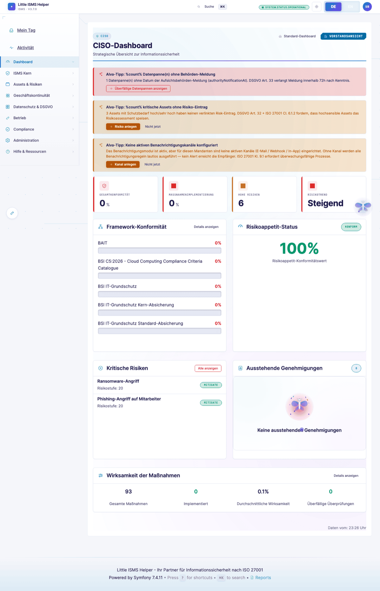

# Little ISMS Helper

<div align="center">


**Multi-Tenant ISMS-Plattform mit Multi-Framework-Compliance -- ISO 27001:2022, NIS2, DORA, TISAX, BSI IT-Grundschutz und 21 weitere Frameworks.**

[](https://www.php.net/)
[](https://symfony.com/)
[](LICENSE)
[](https://www.iso.org/standard/27001)


[Funktionen](#funktionen) |
[Quick Start](#quick-start) |
[Architektur](#architektur) |
[Testing](#testing) |
[Dokumentation](#dokumentation) |
[Lizenz](#lizenz)

</div>

---

## Fuer wen ist dieses Tool?

### Der Sweet Spot

Little ISMS Helper wurde fuer Organisationen gebaut, fuer die Enterprise-ISMS-Tools zu teuer und Spreadsheets zu riskant sind. Der typische Nutzer ist ein IT-Leiter, QM-Beauftragter oder nebenberuflicher ISB der ein ISMS aufbauen muss -- oft ohne dediziertes Security-Budget und ohne externen Berater.

| Organisationsgroesse | Passt? | Warum |
|----------------------|--------|-------|
| **10-50 Mitarbeiter** | Ja | Quick-Entry-Formulare, Essential-Controls-Filter (31 statt 93), Branchen-Baselines mit Vorausfuellung, adaptive Fortschrittsschwellen |
| **51-250 Mitarbeiter** | Ja (Sweet Spot) | Voller Feature-Umfang, Multi-Framework mit Data-Reuse, Holding-Struktur fuer Tochtergesellschaften |
| **251-1.000 Mitarbeiter** | Ja, mit Einschraenkungen | Alle Features vorhanden, aber API-Integrationen (SIEM, Ticketing) muessen selbst gebaut werden |
| **1.000+ Mitarbeiter** | Machbar, braucht Investment | Architektur traegt (Multi-Tenancy, API Platform), aber Integrationslandschaft und SaaS-Betrieb muessen aufgebaut werden |

### Branchen

Besonders geeignet fuer regulierte Branchen im DACH-Raum:

- **Automotive** -- TISAX-Baseline mit VDA-ISA-Mapping
- **Finanzdienstleister** -- DORA-Compliance, BaFin-Anforderungen
- **Gesundheitswesen** -- KRITIS-Health, DiGAV, Patientendatenschutz
- **IT-Dienstleister / Systemhaeuser** -- ISO 27001 fuer Ausschreibungsfaehigkeit, SOC 2
- **Cloud-/Hosting-Provider** -- BSI C5 (2020 + 2026), SOC 2
- **Produktion / Fertigung** -- NIS2 (ab 50 MA / 10 Mio. EUR), BSI IT-Grundschutz
- **Kritische Infrastruktur** -- KRITIS-Dachgesetz, BSI-Meldepflichten

### Typische Nutzerprofile

| Rolle | Was das Tool ihnen bringt |
|-------|--------------------------|
| **IT-Admin als Teilzeit-ISB** | Gefuehrter Einstieg in 7 Phasen, ISO-9001-Bruecke im Glossar, Quick-Entry fuer die ersten Assets und Risiken |
| **Informationssicherheitsbeauftragter (ISB)** | Voller ISMS-Lifecycle, SoA-Management, Risikobehandlungsplaene, Management-Reviews, Audit-Vorbereitung |
| **CISO / Geschaeftsfuehrung** | Board-One-Pager, KPI-Dashboards, Zertifizierungs-Dokumentenpaket als ZIP, Konzern-Uebersicht |
| **Datenschutzbeauftragter (DSB/DPO)** | Verarbeitungsverzeichnis, DSFA, Datenschutzverletzungen mit 72h-Frist, Betroffenenrechte |
| **Compliance Manager** | 25 Frameworks mit Cross-Mapping, transitive Coverage, FTE-Einsparung durch Data-Reuse |
| **Interner / externer Auditor** | Evidence-Management, Audit-Freeze, Audit-Pakete, tamper-evidenter Audit-Trail |

### Was dieses Tool nicht ist

- **Kein Vulnerability-Scanner** -- es verwaltet Schwachstellen, scannt aber keine Systeme
- **Kein SIEM** -- es nimmt Incidents entgegen, sammelt aber keine Logs
- **Kein Dokumentenmanagementsystem** -- es verlinkt Nachweise zu Controls, ist aber kein SharePoint-Ersatz
- **Kein Fertigprodukt fuer den Enterprise-Massenmarkt** -- Integrationen (Jira, ServiceNow, Nessus) muessen fuer grosse Umgebungen ergaenzt werden

### Roadmap und Unterstuetzung

Dieses Projekt wird als Open Source (AGPL v3) entwickelt. Die Kernfunktionalitaet ist produktionsreif -- die folgenden Features erfordern Funding:

| Feature | Status | Impact |
|---------|--------|--------|
| Scanner-Integration (OpenVAS / Nessus) | Geplant | Automatisierte Schwachstellenerfassung |
| Ticketing-Connector (Jira / ServiceNow) | Geplant | Massnahmen-Tracking in bestehenden Workflows |
| SaaS-Deployment mit Self-Service-Signup | Architektur steht | Organisationen ohne Docker-Know-how erreichen |
| Weitere Sprachen (FR, IT, NL, PL) | Infrastruktur steht (96 Domaenen) | Schweizer Markt, EU-weite NIS2-Umsetzung |
| Unabhaengiges Security-Audit | Geplant | Vertrauen fuer sicherheitskritisches Tool |
| API-Ausbau (80 Entities, aktuell 18 exponiert) | Architektur steht | Enterprise-Integrationsfaehigkeit |

**Das Projekt unterstuetzen:** Ueber den Sponsor-Button auf GitHub koennen Sie die Weiterentwicklung direkt foerdern. Jeder Beitrag fliesst in die oben genannten Features.

[](https://github.com/sponsors/moag1000)

---

## Was ist neu in v3.7?

| Bereich | Neuerung |
|---|---|
| **Role-Scope-Architektur** | `TenantScopedAdminVoter` -- `ROLE_ADMIN` ist auf den eigenen Tenant beschraenkt, `ROLE_SUPER_ADMIN` tenant-uebergreifend; Persona-Rollen (`ROLE_CISO`, `ROLE_RISK_MANAGER`, `ROLE_DPO`, `ROLE_COMPLIANCE_MANAGER`) gaten je eigenes Dashboard unter `/dashboards/<persona>` |
| **Lifecycle-Foundation (Symfony Workflow)** | `LifecycleService::transition()`-Facade als Pflicht-Einstieg; 5 produktive Workflows (`document`, `processing_activity`, `isms_objective`, `policy_template`, `asset`) + 11 weitere YAML-Definitionen in `config/workflows/`; Tenant-Overrides via `/admin/lifecycle-overrides` |
| **40+ Status-Enums** | Erste-Klasse-Status-Lifecycle: `DocumentStatus`, `IncidentStatus`, `RiskStatus`, `DataBreachStatus`, etc.; Server-erzwungene 5-Transition-Matrix; bulk-status-change-Support via canonical `_bulk_action_bar.html.twig` |
| **15 YAML-Workflows** | Regulatorische Workflows als YAML-Source-of-Truth (`config/workflows/regulatory/*.yaml`) -- GDPR Data Breach, Incident Response, Risk Treatment, DPIA, DSR, CAPA, Change Request, Management Review, Control Verification, Supplier Assessment, Training Verification, BC-Plan Activation, Document Review, Incident Post-Mortem; Event-getriebene Auto-Progression via Doctrine-Listener |
| **Module-Awareness (43 Module)** | `config/modules.yaml` -- pro Tenant aktivierbare Frameworks/Funktionen; FormType-Trait `ModuleAwareFormTrait`, Controller-Trait `ModuleGatedControllerTrait`, Twig-Funktion `is_module_active()` -- saubere Trennung zwischen Pflicht- und Optional-Feldern |
| **AlvaHint Foundation** | Rules-Engine fuer kontextuelle Hilfetexte (`src/AlvaHint/Rule/`) mit Tier-System, `requiredModules`/`requiredRoles`-Gating und Render-/Dismiss-Telemetrie |
| **22 Compliance-Wizards** | 4 neue Wizards (BSI C5:2026, EUCS, EU CRA, MRIS v1.5); WizardSession 22 Slots; Wizard-History-Diff-View mit Compare-PDF-Export |
| **Industry-Preset Express-Path** | Tag-1-Onboarding in 3 Fragen -- Module und Baselines werden automatisch aktiviert |
| **106 BSI IT-Grundschutz-Bausteine** | Vollstaendiger Baustein-Katalog (vorher 15 Beispiel-Bausteine) |
| **3.543 Cross-Framework-Mappings** | 56 kuratierte YAML-Bibliotheken; Lex-Specialis-Markierungen |
| **Persona-Dashboards** | CISO, Risk-Manager, DPO, Compliance-Manager, Auditor, Board -- rollenspezifisch verkabelt |
| **19-Bucket Mein-Tag-Inbox** | Vollstaendige Inbox-Aggregation aus allen Modulen |
| **Activity-Feed** | Vollansicht `/de/activity-feed` mit Scope-Filter, CSV-Export, HMAC-Verknuepfung |
| **Quick-Fix-Operator-UI** | Web-UI fuer Migrationen, Schema-Reconcile und Daten-Repair ohne CLI |
| **CSRF-Haertung** | 16 Forms + 6 Controller gehaertet; CommentController mit Cross-Tenant-Validation |
| **276 Uebersetzungsdateien / 138 Domaenen** | Vollstaendige i18n-Abdeckung aller neuen Features (DE + EN) |

---

## Funktionen

### Compliance und Frameworks

- **ISO 27001:2022** -- Alle 93 Annex-A-Controls und Clauses 4-10 vollstaendig abgedeckt
- **25 Compliance-Frameworks (vollstaendige Kataloge in der DB)** -- ISO 27001:2022 (93 Annex A), BSI IT-Grundschutz (106 Bausteine, vollstaendiger Katalog), BSI C5:2020 (121), BSI C5:2026 (168, BSI YAML verbatim), NIS2 (85, alle 46 Articles + Art. 21(2) Sub-Letters + Art. 23 Timeline), NIS2-UmsuCG (47, BGBl. 2025 I Nr. 301), DORA (315, Level-1 Articles + Level-2 RTS/ITS/CIR), TISAX (114), GDPR (alle 99 Articles), EU AI Act (alle 113 Articles + 13 Annexe), EU CRA (Annex I + Operative Articles), NIST CSF 2.0 (alle 106 Subcategories), SOC 2 (50), PCI-DSS 4.0.1 (75), ISO 27701:2025 (Annex A + B + Klauseln), ISO 22301 (25), ISO 42001 (Annex A + Klauseln), ISO 27017 (CLD-Erweiterungen + 27002 Cloud-Guidance, 121), ISO 27018 (Annex A + 27002 PII-Guidance, 143), KRITIS, ENISA-EUCS (Mapping-derived bis ENISA Final), MRIS v1.5, BAIT (legacy via DORA obsolet)
- **Cross-Framework-Mapping** -- 56 kuratierte Mapping-Fixtures (~3.543 persistente Mappings), Lex-Specialis-Markierung wo zutreffend (DORA <-> NIS2, NIS2-UmsuCG <-> DORA fuer DE-Finanzdienstleister), 4-stufiger Lifecycle (draft -> review -> approved -> published) mit Provenance-Block je Mapping. Transitive Compliance-Ableitung -- ein Nachweis bedient mehrere Frameworks gleichzeitig (Data-Reuse-Prinzip)
- **22 Compliance-Wizards** -- ISO 27001, NIS2, DORA, TISAX, GDPR, ISO 22301, ISO 27701, ISO 27017, ISO 27018, ISO 42001, BSI IT-Grundschutz, BSI C5:2020, BSI C5:2026, NIST CSF 2.0, KRITIS, PCI-DSS 4.0.1, SOC 2, EU AI Act, EUCS, EU CRA, MRIS v1.5, Industry-Preset-Express
- **Maturity-Reife je Wizard** -- Baseline (KMU-pragmatisch) und Enhanced (audit-ready) als ausklappbare Narrative pro Kategorie in NIS2, DORA, GDPR, EU AI Act
- **Catalogue-Coverage-KPI** -- Wizard-Result zeigt zusaetzlich zur Score `X / Y Anforderungen aus dem Framework-Katalog erfuellt` als Fortschrittsbalken
- **Branchen-Baselines** -- 9 vorkonfigurierte Starter-Pakete (Generic, Production, Finance, KRITIS-Health, Automotive, Cloud, MSP, IT-Service, Hosting) fuer sofortigen Einstieg
- **Framework-Reife-Baselines** -- 35 Reife-Soll-Pakete (7 Frameworks x 5 Branchen: ISO 27001, BSI IT-Grundschutz, BSI C5, NIS2, DORA, TISAX, GDPR x KRITIS/Finance/SaaS/Manufacturing/Healthcare)
- **MRIS v1.5** -- 19 zusaetzliche Branchen-Reife-Baselines mit DE/EN-i18n
- **GSTOOL-XML-Import** -- 5-phasiger Migrationspfad fuer Verinice-Profile (Zielobjekte -> Bausteine -> Massnahmen -> Risikoanalyse), Admin-UI mit Tabbed-Preview
- **SoA-Export** -- Statement of Applicability als PDF, inklusive Management-Review nach Clause 9.3

### Risikomanagement

- **5x5-Risikomatrix** -- Eintrittswahrscheinlichkeit und Auswirkung mit visueller Bewertung
- **Risikobehandlungsplaene** -- Formaler Akzeptanzprozess mit Genehmigungsworkflow und Audit-Trail
- **Risk-Appetite** -- Organisationsweite Schwellenwerte mit automatischer Warnung
- **Periodische Reviews** -- Automatisierte Erinnerungen nach ISO 27001 Clause 6.1.3.d
- **Vulnerability- und Patch-Management** -- CVE/CVSS-Tracking (NIS2-konform)

### GDPR / Datenschutz

- **Verarbeitungsverzeichnis (VVT)** -- Strukturierte Erfassung nach Art. 30 DSGVO
- **DPIA** -- Datenschutz-Folgenabschaetzung nach Art. 35/36 mit 6-Schritt-Workflow
- **Data-Breach-Management** -- 72-Stunden-Meldefrist nach Art. 33 mit automatischem Deadline-Tracking
- **Betroffenenrechte (DSR)** -- Auskunft, Loeschung, Berichtigung, Datenportabilitaet
- **Einwilligungsverwaltung (Consent)** -- Nachweisbare Einwilligungen mit Versionierung

### Business Continuity (BCM)

- **Business-Impact-Analyse** -- RTO, RPO, MTPD nach BSI 200-4
- **BC-Plaene** -- Kontinuitaetsstrategien mit Uebungsverwaltung
- **Krisenstab** -- Rollen und Eskalationspfade nach BSI 200-4
- **Uebungsmanagement** -- Planung, Durchfuehrung und Auswertung von BC-Uebungen

### Workflow-System

- **15 regulatorische Workflows als YAML** -- `config/workflows/regulatory/*.yaml` als Single Source of Truth (GDPR Data Breach 72h, Incident Response hoch/niedrig, Risk Treatment, DPIA, DSR, CAPA, Change Request, Management Review, Control Verification, Supplier Assessment, Training Verification, BC-Plan Activation, Document Review, Incident Post-Mortem)
- **Event-getriebene Auto-Progression** -- `FieldCompletionAutoTransition`-Doctrine-Listener triggert Workflows automatisch beim Speichern relevanter Felder -- keine Service-Aufrufe noetig
- **Symfony-Workflow-Lifecycle** -- 5 produktive Entity-Lifecycles (`document`, `processing_activity`, `isms_objective`, `policy_template`, `asset`) via `LifecycleService::transition()`-Facade mit RBAC, Audit-Log und Tenant-Guard
- **Status-Enum-Foundation** -- 40+ erste-Klasse-Status-Enums mit server-erzwungener 5-Transition-Matrix (`draft -> in_review -> approved -> published -> archived`)
- **Bulk-Status-Change** -- Canonical `_bulk_action_bar.html.twig` mit `actions: ['status_change', 'approve']` fuer Listen-Views
- **AND/OR-Logik** -- Komplexe Bedingungen fuer Workflow-Schritte (z.B. `severity >= high AND count > 100 OR notification_required = true`)
- **Zeitbasierte Schritte** -- Automatische Progression nach konfigurierbarer Wartezeit
- **Cron-Integration** -- `app:process-timed-workflows` fuer vollautomatische Verarbeitung

### Corporate Structure und Multi-Tenancy

- **Holding-/Konzernstruktur** -- Tenant-Hierarchie mit Cycle-Safety und Baseline-Vererbung
- **Group-CISO-Dashboards** -- 7 Konzern-Uebersichten (NIS2-Matrix, Top-10-Risiken, SoA-Matrix 93xN, Supplier-Dedup, Incident-Cross-Post)
- **Policy-Vererbung** -- Mandatory-Policies durchmandatieren oder lokalen Override erlauben
- **Portfolio-Report** -- Delta-Trends via Snapshots mit Drill-Down auf einzelne Requirements

### KPI und Reporting

- **KPI-Dashboard** -- ISMS Health Score, Framework-Compliance, Risk-Appetite, MTTR
- **Taegliche Snapshots** -- 12-Monatstrend mit automatisiertem Cron-Job
- **Board-One-Pager** -- Management-Report als PDF fuer Geschaeftsfuehrung
- **Excel-Exporte** -- Risiken, Assets, Controls, Compliance-Status
- **Glossar** -- 171 Begriffe mit ISO-9001-Analogien fuer Einsteiger

### Setup und Onboarding

- **Setup-Wizard** -- 12 Schritte (Welcome -> Requirements -> Datenbank -> Backup-Restore -> Admin-User -> Email -> Organisation -> Module -> Compliance-Frameworks -> Stammdaten -> Sample-Data -> Abschluss) im einheitlichen Aurora-Layout
- **Industry-Preset Express-Path** -- 3-Fragen-Onboarding (Branche + Groesse + Zertifizierungen) aktiviert automatisch relevante Module und Branchen-Baselines (Tag-1-Onboarding)
- **3-Bucket-Applicability** -- Frameworks automatisch in Pflicht / Empfohlen / Optional klassifiziert
- **Guided Tours** -- Rollenbezogene Einfuehrungen (Junior, ISB, CISO, Auditor, Compliance Manager)
- **Command Palette** -- Cmd+K / Ctrl+K fuer schnellen Zugriff
- **Mein-Tag-Inbox** -- Zentrale Inbox aggregiert 19 Buckets aus allen Modulen (Workflow-Inbox, 4-Eyes, Audit-Findings, DSR-Requests, Policy-Acks, Risk-Reviews, Patch-Deadlines, Control-Evidence, Training, Incidents, BCM und mehr)
- **Quick-Fix-Operator-UI** -- Web-UI unter `/quick-fix` fuer Migrationen anwenden, Schema reconcilen und Daten-Integritaet reparieren -- kein CLI-Zugriff erforderlich fuer Routinebetrieb

### Sicherheit und Administration

- **RBAC** -- USER, AUDITOR, MANAGER, ADMIN, SUPER_ADMIN plus Holding-Rollen ROLE_GROUP_CISO und ROLE_KONZERN_AUDITOR plus Persona-Rollen ROLE_CISO / ROLE_RISK_MANAGER / ROLE_DPO / ROLE_COMPLIANCE_MANAGER (50+ Permissions)
- **Tenant-Scoped Admin** -- `TenantScopedAdminVoter` schraenkt `ROLE_ADMIN` strikt auf den eigenen Tenant ein; nur `ROLE_SUPER_ADMIN` darf tenant-uebergreifend agieren
- **Multi-Auth** -- Lokale Anmeldung, Azure OAuth, SAML, Generic-SSO (OIDC/OAuth2 mit PKCE, JWKS-Verifikation, JIT-Provisioning + Approval-Queue, Domain-Bindung, AEAD-verschluesselte Client-Secrets)
- **MFA** -- TOTP mit Backup-Codes
- **Audit-Log** -- HMAC-SHA256-Chain, tamper-evident, NIS2-konform
- **Audit-Freeze** -- SHA-256-versiegeltes Compliance-Abbild zum Stichtag
- **Backup/Restore** -- AES-256-GCM-Verschluesselung, Tenant-Scoping, DR-Runbook

### Persona-Dashboards und Workflow-Inbox

- **6 Persona-Dashboards** -- CISO, Risk-Manager, DPO, Compliance-Manager, Auditor und Board, je per Persona-Rolle (`ROLE_CISO`, `ROLE_RISK_MANAGER`, `ROLE_DPO`, `ROLE_COMPLIANCE_MANAGER`) gegated unter `/dashboards/<persona>`
- **Board-Dashboard** -- Druckoptimierte Management-Ansicht (PDF-Export) fuer Geschaeftsfuehrung und Aufsichtsgremien
- **AlvaHint-Engine** -- Kontextuelle Hilfetexte mit Rules-Engine (Tier-System, Modul-/Rollen-Gating, Render-/Dismiss-Telemetrie)
- **Activity-Feed** -- Chronologische Event-Uebersicht aus allen Modulen; `?scope=compliance` filtert auf Compliance-relevante Events
- **Workflow-Inbox-Aggregation** -- Alle offenen Workflow-Schritte aller Typen in einer Ansicht

### Design und Barrierefreiheit

- **FairyAurora v4** -- Cyberpunk-Design-System mit Alva-Maskottchen (9 Stimmungen)
- **Dark Mode** -- Vollstaendige Theme-Unterstuetzung
- **WCAG 2.2 AA** -- ARIA, Keyboard-Navigation, Focus-Management, Skip-Links
- **i18n** -- Deutsch und Englisch, 276 Uebersetzungsdateien in 138 Domaenen

---

## Screenshots

Sieben Persona-Perspektiven auf dasselbe ISMS — vollautomatisch via Playwright erzeugt. Komplette Walkthroughs unter [**Sichtwechsel**](docs/sichtwechsel/README.md).

<table>
<tr>
<td width="50%" align="center">
<a href="docs/sichtwechsel/isb-practitioner.md"></a><br/>
<b>ISB / Security Officer</b><br/>
<sub>Dashboard mit offenen Maßnahmen, Reviews, Audit-Trail</sub>
</td>
<td width="50%" align="center">
<a href="docs/sichtwechsel/ciso-executive.md"></a><br/>
<b>CISO / Executive</b><br/>
<sub>Heatmap, Reifegrad-Trend, Vorstands-One-Pager</sub>
</td>
</tr>
<tr>
<td align="center">
<a href="docs/sichtwechsel/compliance-manager.md"></a><br/>
<b>Compliance-Manager / Head of GRC</b><br/>
<sub>25 Frameworks, Cross-Mapping, Data-Reuse</sub>
</td>
<td align="center">
<a href="docs/sichtwechsel/implementer-junior.md"></a><br/>
<b>Junior-Implementer (neu in InfoSec)</b><br/>
<sub>Setup-Wizard, geführte Pfade, Empty-States mit CTA</sub>
</td>
</tr>
<tr>
<td align="center">
<a href="docs/sichtwechsel/risk-owner-business.md"></a><br/>
<b>Risk-Owner / Fachbereichsleiter</b><br/>
<sub>Aufgaben-Inbox, Ein-Klick-Freigaben, Business-Sprache</sub>
</td>
<td align="center">
<a href="docs/sichtwechsel/auditor-external.md"></a><br/>
<b>Externer Auditor (ISO 19011)</b><br/>
<sub>Stichtag-Snapshot, Audit-Log, NC-Detail</sub>
</td>
</tr>
<tr>
<td align="center" colspan="2">
<a href="docs/sichtwechsel/tool-tester.md"></a><br/>
<b>Tool-Tester / QA mit ISMS-Basics</b><br/>
<sub>Reale Umsetzung, i18n-Parität, Aurora-Konformität, Mapping-Qualität — meldet Bugs an Compliance-Manager</sub>
</td>
</tr>
</table>

Bonus: [**Quickstart-Guide mit 11-Schritte-Setup-Wizard**](docs/QUICKSTART.md) · [Junior-Walkthrough textuell](docs/JUNIOR_IMPLEMENTER_WALKTHROUGH.md)

---

## Quick Start

### Docker (empfohlen)

```bash
git clone https://github.com/moag1000/Little-ISMS-Helper.git
cd Little-ISMS-Helper

# Production -- All-in-One mit embedded MariaDB
docker-compose -f docker-compose.prod.yml up -d

# Oeffnen: http://localhost/setup
```

Siehe [DOCKER_PRODUCTION.md](docs/deployment/DOCKER_PRODUCTION.md) fuer Details.

### Lokale Installation

**Voraussetzungen:** PHP 8.4+, Composer 2.x, PostgreSQL 16+ oder MySQL 8.0+

```bash
git clone https://github.com/moag1000/Little-ISMS-Helper.git
cd Little-ISMS-Helper

# Dependencies
composer install
php bin/console importmap:install

# Umgebung konfigurieren
cp .env .env.local
# DATABASE_URL in .env.local anpassen

# Datenbank einrichten
php bin/console doctrine:database:create
php bin/console doctrine:migrations:migrate --no-interaction
php bin/console app:setup-permissions --admin-email=admin@example.com --admin-password=admin123
php bin/console isms:load-annex-a-controls

# Server starten
symfony serve
```

Oeffnen: `http://localhost:8000/setup`

Der Setup-Wizard fuehrt durch Tenant-Erstellung, Framework-Auswahl und Branchen-Baseline. Detaillierte Schritt-fuer-Schritt-Anleitung mit Screenshots: [**Quickstart-Guide**](docs/QUICKSTART.md).

---

## Architektur

### Technologie-Stack

| Komponente | Technologie |
|---|---|
| Backend | PHP 8.4+ (8.5 tested), Symfony 7.4 LTS, Doctrine ORM 3.6, Doctrine-Migrations-Bundle 4.0 |
| Frontend | Twig 3.24, Bootstrap 5.3, Stimulus 3.2, Turbo 8 (Hotwire), Chart.js 4 |
| API | API Platform 4.3, OpenAPI 3.0 |
| Datenbank | PostgreSQL 16+ / MySQL 8.0+ / MariaDB 10.11+ |
| Export | Dompdf >=3.1.5 (PDF), PhpSpreadsheet >=5.7 (Excel) |
| Testing | PHPUnit 13.1 |
| Design | FairyAurora v4 |

### Projektstruktur

```
src/
  Entity/         113 Doctrine-Entities (alle mit tenant_id)
  Controller/     183 HTTP-Controller
  Service/        352 Business-Logic-Services (inkl. Sub-Packages)
  Command/        141 Console-Commands
  Enum/            43 Status-Enums (DocumentStatus, IncidentStatus, ...)
  Lifecycle/          LifecycleService-Facade + EntityTypeRegistry
  AlvaHint/           Rules-Engine fuer kontextuelle Hilfetexte
  Security/Voter/     Authorization-Voter (inkl. TenantScopedAdminVoter)

templates/        Twig-Templates mit Aurora v4 Macros
translations/     276 YAML-Dateien (138 Domaenen x 2 Sprachen)
tests/            816 Testdateien (Unit + WebTestCase + Lifecycle)
config/
  modules.yaml             43 Module-Definitionen
  active_modules.yaml      Per-Tenant-Aktivierungs-Overrides
  workflows/               16 Lifecycle-Workflows (Symfony Workflow)
  workflows/regulatory/    15 regulatorische YAML-Workflows
```

Vollstaendiger Entwickler-Guide -- inklusive Patterns, Pre-Commit-Checks und
Common Pitfalls -- siehe [`CLAUDE.md`](CLAUDE.md).

### Kern-Services

| Service | Aufgabe |
|---|---|
| `TenantContext` | Multi-Tenant-Scoping |
| `RiskService`, `AssetService`, `ControlService` | ISMS-Kern-CRUD |
| `LifecycleService` | Symfony-Workflow-Lifecycle-Facade (`transition()` als kanonischer Einstieg) |
| `WorkflowService` | Workflow-Instanzverwaltung (stabile Public-API-Fassade) |
| `FieldCompletionAutoTransition` | Event-Listener fuer YAML-Workflow-Auto-Progression (canonical) |
| `ModuleConfigurationService` | Pro-Tenant-Modul-Aktivierungspruefung |
| `AuditLogger` | Tamper-evidenter Audit-Trail (HMAC-SHA256-Chain) |
| `BackupService`, `RestoreService` | Backup/Restore mit AES-256-GCM-Verschluesselung |
| `ComplianceMappingService` | Cross-Framework-Mapping und Data Reuse |

### Wichtige Patterns

- **Multi-Tenancy:** Jede Entity traegt `tenant_id`. `TenantContext` filtert automatisch. `TenantScopedAdminVoter` haelt `ROLE_ADMIN` strikt auf den eigenen Tenant.
- **RBAC:** USER bis SUPER_ADMIN + Holding-Rollen (ROLE_GROUP_CISO, ROLE_KONZERN_AUDITOR) + Persona-Rollen (ROLE_CISO, ROLE_RISK_MANAGER, ROLE_DPO, ROLE_COMPLIANCE_MANAGER), 50+ granulare Permissions via Voter.
- **Lifecycle-Foundation:** Status-Uebergaenge ueber `LifecycleService::transition()`-Facade. YAML-Baseline unter `config/workflows/<entity>.yaml`, per-Tenant-Overrides via `/admin/lifecycle-overrides`. Direkte `setStatus()`-Aufrufe sind anti-pattern.
- **Module-Awareness:** Optional-Features werden ueber `config/modules.yaml` (43 Module) gegated. FormType-Trait `ModuleAwareFormTrait`, Controller-Trait `ModuleGatedControllerTrait`, Twig-Funktion `is_module_active()`. Vollstaendige Referenz: [`docs/MODULE_GATING_GUIDE.md`](docs/MODULE_GATING_GUIDE.md).
- **Data Reuse:** Ein Nachweis wird ueber Cross-Framework-Mappings mehreren Frameworks zugeordnet. Review-Pflicht bei Uebernahme.
- **Workflow Auto-Progression:** YAML-Workflows in `config/workflows/regulatory/*.yaml`. Doctrine-Listener triggert Schritte automatisch bei Feldaenderungen (AND/OR-Logik, zeitbasiert).

---

## Testing

```bash
# Alle Tests ausfuehren
php bin/phpunit

# Einzelne Suite
php bin/phpunit tests/Controller/
php bin/phpunit tests/Service/RiskServiceTest.php

# Lesbare Ausgabe
php bin/phpunit --testdox
```

### Test-Datenbank einrichten

```bash
php bin/console doctrine:database:create --env=test
php bin/console doctrine:migrations:migrate --env=test --no-interaction
php bin/console app:setup-permissions --admin-email=test@example.com --admin-password=test123 --env=test
php bin/console isms:load-annex-a-controls --env=test
```

### Statistiken

| Metrik | Wert |
|---|---|
| Testdateien | 816 |
| Test-LOC | ~75.500 |
| Controller-Tests | ~1.100 |
| Service-Tests | ~900 |
| Repository-Tests | ~400 |
| Entity-Tests | ~128 |
| Lifecycle-Tests | unter `tests/Lifecycle/` |

---

## Dokumentation

### Einstieg

| Dokument | Thema |
|---|---|
| [Quickstart](docs/QUICKSTART.md) | Vom Klon zum laufenden ISMS in 30 Min — Setup-Wizard 11 Schritte mit Screenshots |
| [Sichtwechsel](docs/sichtwechsel/README.md) | Sieben Persona-Perspektiven aufs Tool — ISB, CISO, Compliance-Manager, Junior, Risk-Owner, Auditor, Tool-Tester |
| [Junior-Walkthrough](docs/JUNIOR_IMPLEMENTER_WALKTHROUGH.md) | Detail-Walkthrough aus 9001-Quereinsteiger-Sicht |

### Benutzerhandbuecher (v3.5 neu)

| Dokument | Thema |
|---|---|
| [Compliance-Wizard](docs/user-guide/COMPLIANCE_WIZARD.md) | 22 Wizards, WizardSession, Diff-View, Industry-Preset Express-Path, Cross-Framework-Mapping-Hub |
| [Persona-Dashboards](docs/user-guide/PERSONA_DASHBOARDS.md) | 5 Rollen-Dashboards (CISO, Risk-Manager, DPO, CM, Auditor), Mega-Menu-Gating |
| [Mein Tag](docs/user-guide/MEIN_TAG.md) | 19 Buckets, Visibility-Gating, Workflow-Inbox-Aggregation, Auto-Reactions |
| [Activity-Feed](docs/user-guide/ACTIVITY_FEED.md) | Scope-Filter, Datenquellen, CSV-Export, Tamper-Evidenz-Verknuepfung |
| [Quick-Fix-Operator-UI](docs/user-guide/QUICK_FIX.md) | Migrationen, Schema-Reconcile, Daten-Repair, Guard-Konfiguration |
| [Modulverwaltung](docs/user-guide/MODULE_AKTIVIERUNG.md) | Module aktivieren und konfigurieren (User-Guide) |

### Setup und Deployment

| Dokument | Thema |
|---|---|
| [Docker Setup](docs/setup/DOCKER_SETUP.md) | Entwicklungs-Setup mit Docker Compose |
| [Docker Production](docs/deployment/DOCKER_PRODUCTION.md) | All-in-One Production Container |
| [Deployment Wizard](docs/deployment/DEPLOYMENT_WIZARD.md) | 10-Schritte-Setup ohne Docker |
| [Plesk Deployment](docs/deployment/DEPLOYMENT_PLESK.md) | Strato/Plesk-spezifisches Setup |
| [Authentication](docs/setup/AUTHENTICATION_SETUP.md) | RBAC, Azure OAuth, SAML |
| [API Setup](docs/setup/API_SETUP.md) | REST API, Swagger UI |

### Architektur und Compliance

| Dokument | Thema |
|---|---|
| [Solution Description](docs/architecture/SOLUTION_DESCRIPTION.md) | Architektur-Uebersicht |
| [Data Reuse Analysis](docs/architecture/DATA_REUSE_ANALYSIS.md) | Cross-Modul-Datenwiederverwendung |
| [Cross-Framework Mappings](docs/architecture/CROSS_FRAMEWORK_MAPPINGS.md) | Multi-Framework-Mapping-Architektur |
| [ISO Compliance](docs/compliance/ISO_COMPLIANCE_IMPLEMENTATION_SUMMARY.md) | ISO 27001:2022 Implementierungsdetails |
| [Corporate Structure](docs/CORPORATE_STRUCTURE.md) | Holding-/Konzern-Governance |

### Betrieb

| Dokument | Thema |
|---|---|
| [Disaster Recovery](docs/operations/DISASTER_RECOVERY.md) | Backup-Scope, Restore-Szenarien, APP_SECRET |
| [Backup Architecture](docs/operations/BACKUP_ARCHITECTURE.md) | Format 2.0, Entity-Coverage, Dependency-Order |
| [Audit Logging](docs/setup/AUDIT_LOGGING.md) | HMAC-Chain, Verifikation |
| [Admin Guide](docs/ADMIN_GUIDE.md) | Admin-Portal-Referenz |

### UI/UX

| Dokument | Thema |
|---|---|
| [UI/UX Quick Start](docs/ui-ux/UI_UX_QUICK_START.md) | Keyboard Shortcuts, Command Palette |
| [UI Patterns](docs/ui-patterns/README.md) | Komponenten-Bibliothek |
| [Accessibility](docs/ui-patterns/ACCESSIBILITY.md) | WCAG 2.2 AA Richtlinien |

### Security

| Dokument | Thema |
|---|---|
| [Security Architecture](docs/security/SECURITY.md) | Sicherheitsarchitektur |
| [OWASP Audit](docs/reports/security-audit-owasp-2025-rc1.md) | Security Audit Report |
| [License Report](docs/reports/license-report.md) | Third-Party-Lizenz-Compliance |

---

## Projekt unterstuetzen

Wenn Ihnen der Little ISMS Helper weiterhilft, freue ich mich ueber Unterstuetzung:

<a href="https://www.buymeacoffee.com/moag1000" target="_blank"></a>

---

## Honorable Mentions -- Open-Source ISMS- und Compliance-Landschaft

Der Little ISMS Helper steht nicht allein. Andere Open-Source-Projekte haben
das Feld mitgepraegt -- mit unterschiedlichen Schwerpunkten und Zielgruppen.
Faires Acknowledgement, ohne diese Projekte direkt zu uebernehmen.

### DACH-Raum

- **Privater Vorlaeufer (2024)** -- Ein anonymer Maintainer aus dem
  norddeutschen Raum hat ein verwandtes ISMS-Konzept als Excel-Sammlung +
  Markdown-Dokumentation veroeffentlicht. Inspirationsquelle fuer einige
  unserer fruehen Datenmodell-Entscheidungen.

### EU und international

- **[paolocarner/nis2-sme-toolkit](https://github.com/paolocarner/nis2-sme-toolkit)**
  -- KMU-orientiertes NIS2-Toolkit (BE/NL-Fokus, EN), Excel + RTF.
  Inspiration fuer Baseline-vs-Enhanced Maturity-Konzept in unserem
  NIS2-Wizard. CC BY 4.0.
- **[theopenlane/awesome-compliance](https://github.com/theopenlane/awesome-compliance)**
  -- Kuratierte Liste mit ~200 Compliance-Resources. Nuetzlich als
  Referenzkatalog, wenn auch stark US/SOC2-lastig.
- **[Openlane](https://github.com/theopenlane)** -- SOC2/ISO-27001-Plattform
  als Architektur-Inspiration. Apache 2.0.
- **[strongdm/comply](https://github.com/strongdm/comply)** -- Markdown-basierte
  SOC2-Policy-Templates und Document-Pipeline. Apache 2.0.
- **[ComplianceAsCode/auditree-framework](https://github.com/ComplianceAsCode/auditree-framework)**
  -- IBM-Framework fuer automatisierte Evidence-Sammlung als versionierter
  Code. Apache 2.0.
- **[getprobo/probo](https://github.com/getprobo/probo)** -- SOC2/ISO-27001
  Compliance-Automation, Open-Source.
- **[microsoft/data-protection-mapping-project](https://github.com/microsoft/data-protection-mapping-project)**
  -- GDPR/CCPA Mapping-Daten von Microsoft.
- **[coolstartnow/isms-builder](https://github.com/coolstartnow/isms-builder)**
  -- ISMS-Strukturgenerator mit Markdown-Output.

### Funktional verwandte Open-Source-Projekte (mit kommerzieller Variante)

- **[CISO Assistant](https://github.com/intuitem/ciso-assistant-community)** --
  Open-Source-GRC mit 40+ Frameworks. Direkt funktional vergleichbar im
  Multi-Framework-Ansatz. Kommerzielle Enterprise-Variante verfuegbar
  ([intuitem.com](https://intuitem.com/)). Faires Pendant fuer Anwender,
  die ein groesseres Ecosystem oder Hersteller-Support brauchen.

### Was Little ISMS Helper anders macht

- **DACH-Fokus aus erster Hand** -- BSI-Grundschutz (Basis/Standard/Kern),
  BSI C5, KRITIS, TISAX als First-Class-Citizens, nicht als nachtraeglich
  gemappte ISO-Crosswalks
- **Deutschsprachig zuerst, EN als Zweitsprache**
- **18+ Compliance-Wizards** mit nativen DACH-Frameworks
- **Single-Tenant-Selbsthostung** auf Pi/Cloud ohne Vendor-Lock-In
- **AGPL-3.0** -- Quellcode-Offenlegung verpflichtend bei SaaS-Betrieb,
  schuetzt Community vor Closed-Source-Forks

---

## Lizenz

**GNU Affero General Public License v3.0 (AGPL-3.0)**

Freie Nutzung, Modifikation und Verteilung -- auch kommerziell. Quellcode-Offenlegung bei SaaS-Betrieb erforderlich.

Siehe [LICENSE](LICENSE) fuer den vollstaendigen Text.

---

<div align="center">

Little ISMS Helper -- Open-Source ISMS fuer den deutschsprachigen Markt

[GitHub Issues](https://github.com/moag1000/Little-ISMS-Helper/issues) |
[Dokumentation](docs/)

</div>
