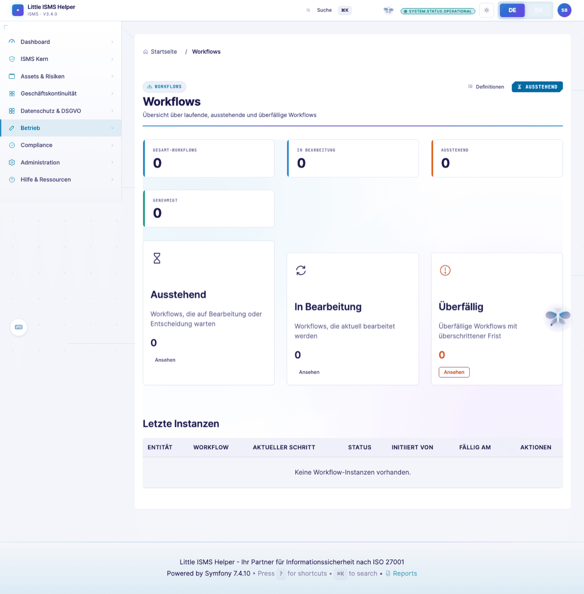

# Workflow Auto-Progression System

> User-facing workflow inbox view (Risk-Owner perspective): [Sichtwechsel — Risk-Owner](sichtwechsel/risk-owner-business.md)

## Overview

The Workflow Auto-Progression System enables **event-driven workflows** where workflow steps automatically progress based on user actions in modules. This creates a non-invasive approval process that aligns with natural user workflows.

**Key Principle**: Instead of users having to explicitly approve workflow steps, completing relevant fields in entities (like DataBreach, Incident, Risk) automatically advances the workflow.



## Architecture

### Components

1. **WorkflowAutoProgressionService** (`src/Service/WorkflowAutoProgressionService.php`)
   - Core service that checks if workflow steps can auto-progress
   - Evaluates field completion conditions
   - Automatically approves steps when conditions are met

2. **WorkflowStep Metadata** (`src/Entity/WorkflowStep.php`)
   - New `metadata` JSON field stores auto-progression conditions
   - Defines which fields must be completed for auto-progression
   - Supports conditional logic (e.g., "severity >= high")

3. **Integration Points**
   - `DataBreachService::update()` - Checks auto-progression after DataBreach updates
   - Other entity services (Incident, Risk, etc.) can integrate similarly

## How It Works

### Example: GDPR Data Breach Workflow

```
Step 1: "Initial Assessment (DPO)" - Requires fields:
  - severity
  - affectedDataSubjectsCount
  - dataCategories
  - notificationRequired

User Action:
1. DPO creates DataBreach entity
2. DPO fills out the 4 required fields
3. DPO clicks "Save"

Auto-Progression:
✓ WorkflowAutoProgressionService detects all fields are filled
✓ Step 1 auto-approved with comment: "Step automatically approved based on field completion"
✓ Workflow moves to Step 2: "Technical Assessment (CISO)"
✓ CISO receives notification email

Benefits:
- DPO doesn't need to navigate to separate workflow approval page
- Workflow progresses naturally as part of normal work
- Clear audit trail shows who filled which fields when
```

### Workflow Step Metadata Structure

```json
{
  "autoProgressConditions": {
    "type": "field_completion",
    "entity": "DataBreach",
    "fields": [
      "severity",
      "affectedDataSubjectsCount",
      "dataCategories",
      "notificationRequired"
    ],
    "condition": "severity >= high"  // Optional
  }
}
```

#### Auto-Progression Types

**1. `field_completion`** - Progress when fields are filled
```json
{
  "type": "field_completion",
  "entity": "DataBreach",
  "fields": ["severity", "affectedDataSubjectsCount"]
}
```

**2. `auto`** - Progress immediately (for notification steps)
```json
{
  "type": "auto",
  "condition": "severity >= high"  // Optional gate
}
```

#### Supported Conditions

- `field >= value` - Greater than or equal
- `field <= value` - Less than or equal
- `field > value` - Greater than
- `field < value` - Less than
- `field = value` - Equal
- `field != value` - Not equal

Examples:
- `severity >= high`
- `affectedDataSubjectsCount > 100`
- `notificationRequired = true`

## Regulatory-Compliant Workflows

### Generate Pre-Configured Workflows

```bash
# Generate all regulatory workflows
php bin/console app:generate-regulatory-workflows

# Generate specific workflow
php bin/console app:generate-regulatory-workflows --workflow=data-breach

# Overwrite existing definitions
php bin/console app:generate-regulatory-workflows --overwrite
```

### Available Workflows

#### 1. GDPR Data Breach Notification (Art. 33/34)
- **Entity**: `DataBreach`
- **Total SLA**: 72 hours (regulatory requirement)
- **Steps**: 6 steps with role-based approval
- **Auto-Progression**: Enabled for DPO, CISO, and Management steps

**Key Features**:
- Step 1: DPO Initial Assessment (24h) - Auto-progresses when severity, affected subjects, and data categories filled
- Step 2: Technical Assessment (24h) - Auto-progresses when root cause and containment measures documented
- Step 3: Management Notification (auto) - Auto-sends notification to management for high-severity breaches
- Step 4: Authority Notification (72h total) - Auto-progresses when notification date/method recorded
- Step 5: Data Subject Notification - Auto-progresses when notification sent (if required)
- Step 6: Final Documentation (7 days) - Auto-progresses when lessons learned documented

#### 2. Incident Response - High/Critical Severity
- **Entity**: `Incident`
- **Steps**: 6 steps (Immediate Response → Post-Incident Review)
- **Auto-Progression**: Configured for crisis management workflow

#### 3. Incident Response - Low/Medium Severity
- **Entity**: `Incident`
- **Steps**: 4 steps (Triage → Review)
- **Auto-Progression**: Standard incident handling

#### 4. Risk Treatment Plan Approval
- **Entity**: `Risk`
- **Steps**: 6 steps (Risk Owner → Audit Committee)
- **Auto-Progression**: Based on risk value thresholds

#### 5. DPIA - Data Protection Impact Assessment
- **Entity**: `DPIA`
- **Steps**: 6 steps (Creation → Final Check)
- **Auto-Progression**: Based on assessment completion

## Integration Guide

### Adding Auto-Progression to an Entity

**Step 1**: Add `WorkflowAutoProgressionService` to entity service

```php
// src/Service/IncidentService.php
public function __construct(
    private readonly EntityManagerInterface $entityManager,
    private readonly WorkflowAutoProgressionService $workflowAutoProgressionService,
    // ... other services
) {}
```

**Step 2**: Call auto-progression after entity update

```php
public function update(Incident $incident, User $user): Incident
{
    // ... existing update logic ...

    $this->entityManager->flush();

    // Check and auto-progress workflow
    $this->workflowAutoProgressionService->checkAndProgressWorkflow($incident, $user);

    return $incident;
}
```

**Step 3**: Define auto-progression conditions in workflow definition

```php
// When creating WorkflowStep
$step->setMetadata([
    'autoProgressConditions' => [
        'type' => 'field_completion',
        'entity' => 'Incident',
        'fields' => ['rootCause', 'affectedSystems', 'containmentMeasures'],
    ],
]);
```

## Audit Trail

Auto-approved steps are logged in the workflow approval history with:

```json
{
  "step_id": 123,
  "step_name": "Initial Assessment (DPO)",
  "action": "auto_approved",
  "approver_id": 42,
  "approver_name": "John Doe",
  "comments": "Step automatically approved based on field completion",
  "timestamp": "2025-11-29 10:30:00",
  "auto_progression": true,
  "trigger_entity": "DataBreach"
}
```

This provides complete traceability showing:
- Who filled the fields that triggered auto-progression
- When the auto-progression occurred
- Which entity triggered the progression

## Benefits

### 1. Non-Invasive Compliance
Users don't need to understand or navigate separate workflow screens. They simply fill out the relevant fields in their normal workflow.

### 2. Regulatory Compliance
Workflows progress according to regulatory requirements (GDPR Art. 33/34, ISO 27001) with proper audit trails.

### 3. Clear Responsibilities
Each workflow step clearly defines:
- Who is responsible (role-based)
- What needs to be completed (field-based)
- When it must be done (SLA-based)

### 4. Automatic Notifications
As workflows progress, the system automatically notifies the next approver, ensuring timely action.

### 5. Flexible Configuration
Workflows can be configured for different entities, severities, and compliance requirements without code changes.

## Testing

### Manual Testing

1. **Generate Data Breach Workflow**
   ```bash
   php bin/console app:generate-regulatory-workflows --workflow=data-breach
   ```

2. **Create Data Breach Entity**
   - Navigate to Data Breach module
   - Create new breach
   - Workflow should auto-start

3. **Fill DPO Assessment Fields**
   - severity: `high`
   - affectedDataSubjectsCount: `150`
   - dataCategories: `['Personal Identifiable Information']`
   - notificationRequired: `true`

4. **Save Entity**
   - Workflow Step 1 should auto-approve
   - Check workflow approval history for auto-approval entry
   - Verify CISO receives notification for Step 2

### Verifying Auto-Progression

Check workflow instance approval history:

```bash
# Via database
SELECT * FROM workflow_instances WHERE entity_type = 'DataBreach' AND entity_id = 123;
SELECT approval_history FROM workflow_instances WHERE id = <workflow_instance_id>;
```

Or view in UI:
- Navigate to Workflows → Active Workflows
- Click on workflow instance
- View Activity Log

You should see:
```
✓ Step 1: Initial Assessment (DPO) - Auto-approved by John Doe
  Comment: Step automatically approved based on field completion
  Timestamp: 2025-11-29 10:30:00
```

## Troubleshooting

### Workflow Not Auto-Progressing

**Check 1**: Verify workflow instance exists and is active
```bash
php bin/console doctrine:query:sql "SELECT * FROM workflow_instances WHERE entity_type = 'DataBreach' AND status = 'in_progress'"
```

**Check 2**: Verify step has auto-progression metadata
```bash
php bin/console doctrine:query:sql "SELECT id, name, metadata FROM workflow_steps WHERE workflow_id = <workflow_id>"
```

**Check 3**: Check application logs
```bash
tail -f var/log/dev.log | grep "Workflow auto-progressed"
```

**Check 4**: Verify all required fields are filled
- Check entity in database
- Ensure fields are not NULL, empty string, or empty array

**Check 5**: Verify user has permission to trigger auto-progression
- Auto-progression uses the updating user's context
- User must have permission to save the entity

### Common Issues

**Issue**: Step auto-approves but workflow doesn't move to next step
- **Cause**: Next step is notification type and also auto-progresses
- **Solution**: Check next step's metadata - this is expected behavior for consecutive notification steps

**Issue**: Condition not evaluating correctly
- **Cause**: Field type mismatch (string vs. number, etc.)
- **Solution**: Ensure condition values match field types. Use quotes for strings: `status = 'closed'`

**Issue**: Auto-progression creates duplicate approvals
- **Cause**: Service called multiple times in same request
- **Solution**: Ensure flush() happens only once per request

## Advanced Features (✅ IMPLEMENTED)

### 1. Advanced Conditions with AND/OR Logic ✅

**Status**: ✅ IMPLEMENTED

Support for complex boolean logic with AND/OR operators:

```json
{
  "autoProgressConditions": {
    "type": "field_completion",
    "entity": "DataBreach",
    "fields": ["severity", "affectedDataSubjectsCount"],
    "condition": "(severity >= high AND affectedDataSubjectsCount > 100) OR notificationRequired = true"
  }
}
```

**How it works**:
- Supports nested AND/OR expressions
- Parentheses for grouping
- Standard precedence: AND before OR
- All simple operators: `>=`, `<=`, `>`, `<`, `=`, `!=`

**Examples**:

```json
// Complex risk assessment
{
  "condition": "(severity = critical OR (severity = high AND impact > 50000)) AND status != resolved"
}

// Multi-factor data breach assessment
{
  "condition": "(dataTypes contains sensitive AND affectedCount > 1000) OR regulatoryRequirement = true"
}

// Time-sensitive incident
{
  "condition": "severity >= high AND detectedWithin < 1 OR businessCritical = true"
}
```

### 2. Time-Based Auto-Progression ✅

**Status**: ✅ IMPLEMENTED

Workflows can auto-progress after a time delay:

```json
{
  "autoProgressConditions": {
    "type": "time_based",
    "delay": "24 hours",
    "condition": "status = 'pending'"  // Optional
  }
}
```

**Setup**:

1. **Add to workflow step metadata** when creating workflow
2. **Run cron job** to process timed workflows:

```bash
# Test it first
php bin/console app:process-timed-workflows --dry-run

# Add to crontab (every 15 minutes)
0,15,30,45 * * * * cd /path/to/app && php bin/console app:process-timed-workflows
```

**Supported time units**:
- `X minutes` (e.g., "30 minutes")
- `X hours` (e.g., "24 hours")
- `X days` (e.g., "7 days")

**Use Cases**:

**Waiting Period**:
```json
{
  "type": "time_based",
  "delay": "72 hours",
  "condition": "objectionReceived = false"
}
```
*Auto-progress after 72h if no objection received*

**Escalation Timeout**:
```json
{
  "type": "time_based",
  "delay": "48 hours",
  "condition": "status = 'pending_review'"
}
```
*Auto-escalate if no review after 48h*

**Cooling Period**:
```json
{
  "type": "time_based",
  "delay": "7 days"
}
```
*Mandatory 7-day waiting period (unconditional)*

## Future Enhancements

### Planned Features

1. **Field Change Detection** - Only auto-progress when specific fields change
   ```json
   {
     "type": "field_change",
     "fields": ["severity"],
     "from": "low",
     "to": "high"
   }
   ```

2. **External System Integration** - Auto-progress based on external events
   ```json
   {
     "type": "external_webhook",
     "url": "https://api.example.com/breach-confirmed",
     "expectedResponse": {"status": "confirmed"}
   }
   ```

## References

- [WORKFLOW_REQUIREMENTS.md](WORKFLOW_REQUIREMENTS.md) - Regulatory requirements and SLAs
- [ISO 27001:2022](https://www.iso.org/standard/27001) - Information security management
- [GDPR Art. 33/34](https://gdpr-info.eu/) - Data breach notification requirements
- [BSI IT-Grundschutz](https://www.bsi.bund.de/) - German IT security baseline

## Support

For questions or issues with the workflow system:
1. Check this documentation
2. Review `docs/WORKFLOW_REQUIREMENTS.md` for regulatory context
3. Check application logs in `var/log/dev.log`
4. Review workflow instance approval history in the UI
