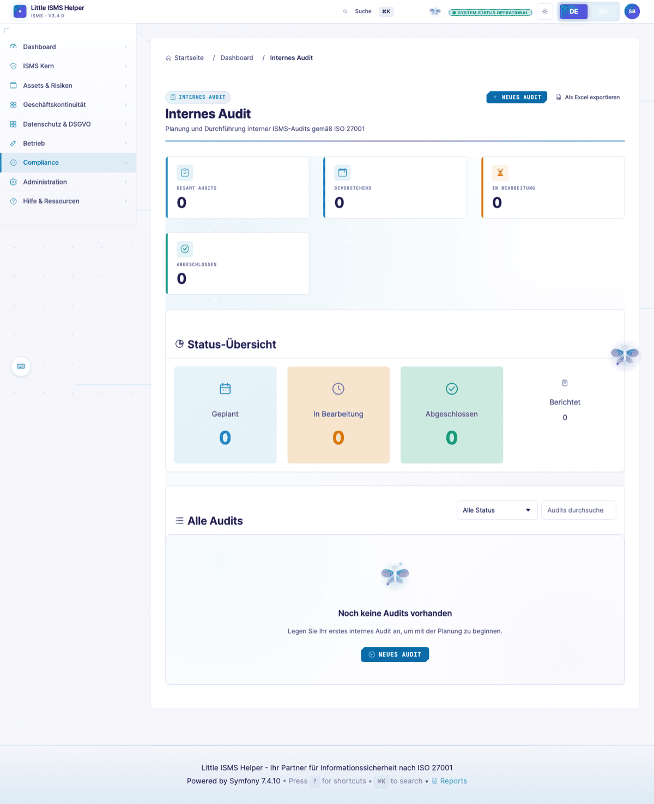
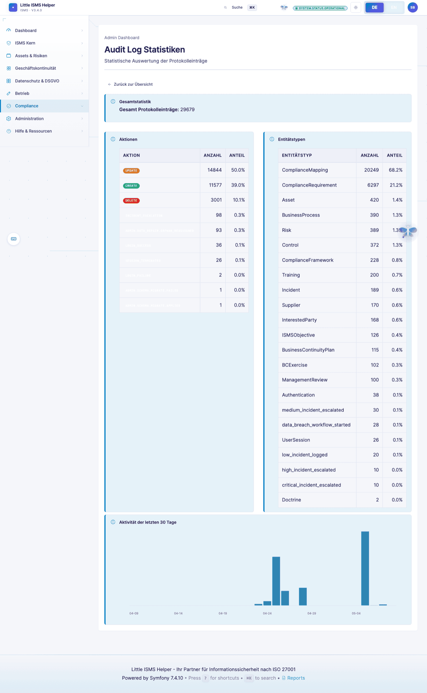
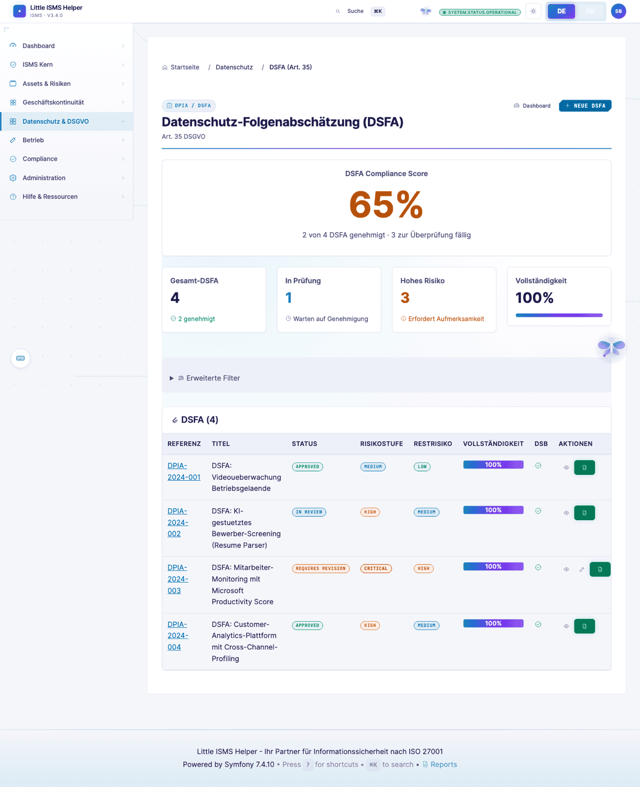
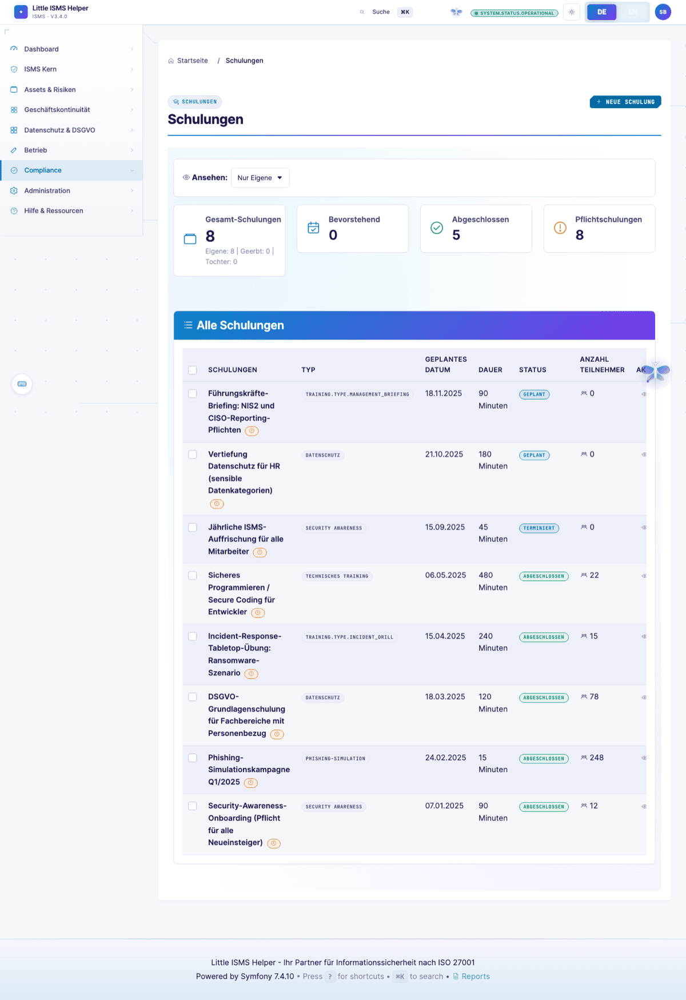

# Externer Auditor — Evidence statt Erzählungen

> **Wer:** Leitender Auditor einer akkreditierten Zertifizierungsstelle (ISO 27001, 27701, 22301, BSI IT-Grundschutz). ISO 19011 als Methodikrahmen.
> **Denkweise:** "Zeige es mir" statt "erzähl es mir". Konsistenz Policy↔SoA↔Umsetzung↔Wirksamkeit. Major-/Minor-NC, Observation, OFI.
> **Frust-Trigger:** Audit-Trail nicht manipulationssicher, kein Stichtags-Export, fehlende Versionierung.
>
> Volle Persona-Definition: [`.claude/skills/persona-auditor-external`](../../.claude/skills/persona-auditor-external/)

[← Zurück zur Übersicht](README.md)

---

## Auditor-Dashboard

Rollen-spezifische Sicht für externe Prüfer (`ROLE_AUDITOR`) mit Lese-Zugriff. Audit-Programm-Status, anstehende Findings, Document-Updates seit letztem Audit.

---

## Audit-Programm

Internes Audit-Programm — Audits geplant, durchgeführt, mit Findings und Korrekturmaßnahmen. ISO 27001 Klausel 9.2.

> *"Bitte zeigen Sie mir Evidence zu Control A.5.1 für den Zeitraum Q1–Q3."*

---

## Audit-Freeze

Read-Only-Modus während externer Audit. SHA256-versiegelte Snapshots, Live-Daten geschützt.

ISO 27001 Klausel 9.2 + 9.3 verlangen reproduzierbare Evidence — der Freeze macht den Stichprobenstand zwei Monate später noch nachvollziehbar.

---

## Audit-Log

Manipulationssicher, gefiltert nach Wer/Wann/Was. Klausel 7.5 (dokumentierte Information) und 9.1 (Überwachung).

> *"Wer hat das freigegeben und wann? Das Risiko ist seit 18 Monaten auf 'akzeptiert' — wer hat die Akzeptanz wann erneuert?"*

---

## Audit-Log-Statistik

Aggregation nach User/Entity/Aktion über Zeit — Datenpunkt für Management-Review.

---

## DPIA-Liste

Datenschutz-Folgenabschätzungen gemäß DSGVO Art. 35. Status, Risiko-Klasse, Aufsichtsbehörden-Konsultation.

---

## Schulungen-Nachweise

Kompetenznachweise gemäß ISO 27001 Klausel 7.2. Schulungsplan, Teilnahme, Wirksamkeitsmessung.

---

## Querverweise

- **SoA + Wirksamkeitsmessung**: [ISB-Sicht](isb-practitioner.md)
- **Management-Review**: [ISB → Management-Review](isb-practitioner.md#management-review)
- **Cross-Framework-Coverage**: [Compliance-Manager-Sicht](compliance-manager.md)

---

## Was der Auditor vermisst

Aus der [Persona-Definition](../../.claude/skills/persona-auditor-external/):

- **Point-in-Time-Sicht** für jede Entity (heute nur SoA-Freeze; auch Risikoregister/Asset-Register/Document-Lenkung sollten Stichtags-Snapshot haben)
- **Ursachenanalyse-Feld** strukturiert in NC-Detail
- **Erzwungene Genehmigungs-/Review-Zyklen** in Dokumentenlenkung — Klausel 7.5
- **Audit-Bericht-Export** mit Major-/Minor-/Observation-Klassifikation als PDF

---

[← Risk-Owner](risk-owner-business.md) · [Zurück zur Sichtwechsel-Übersicht](README.md)
