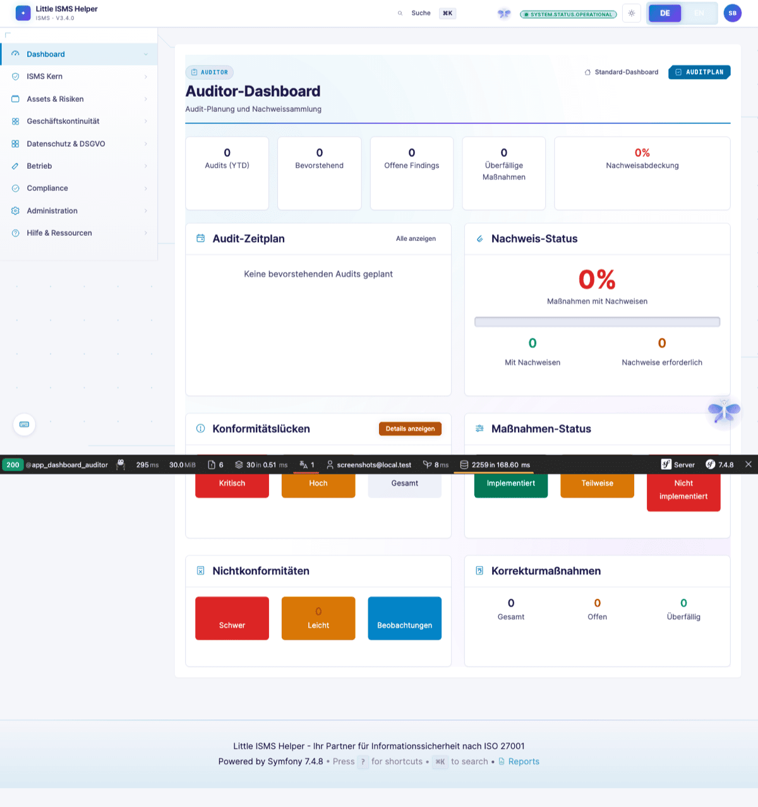
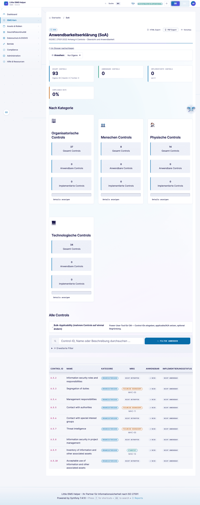
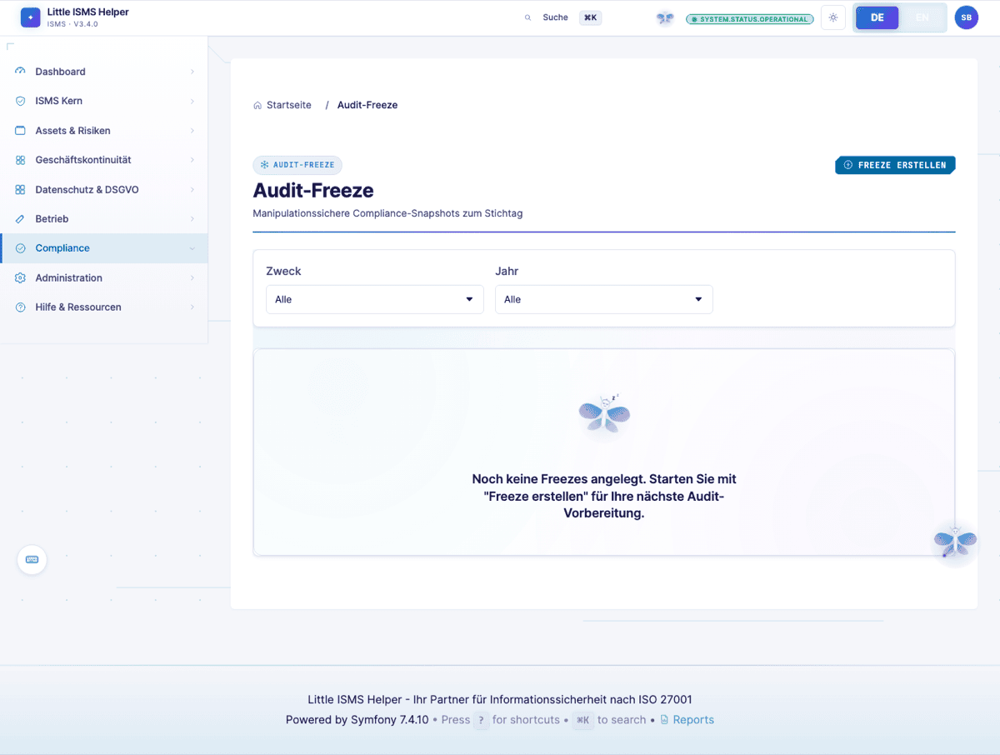
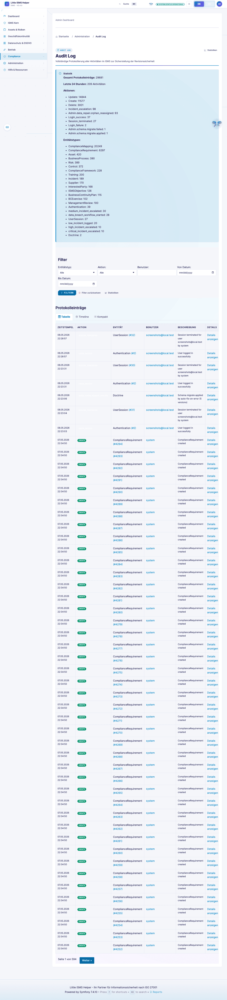
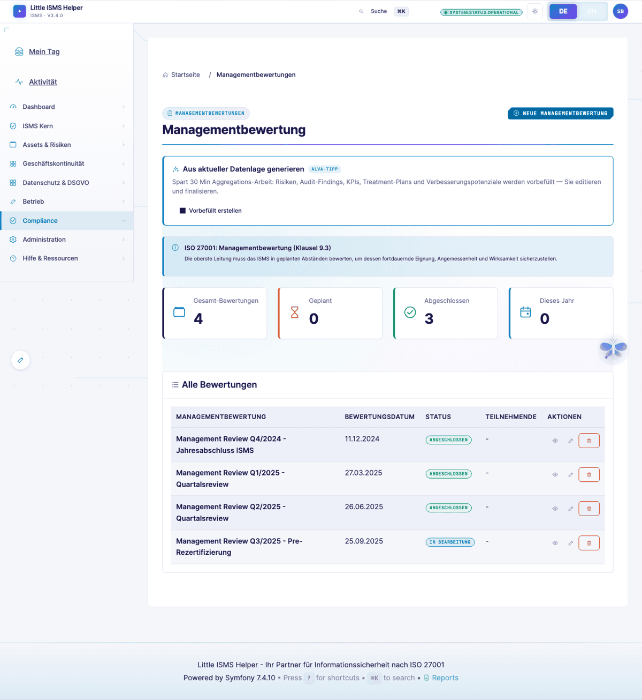
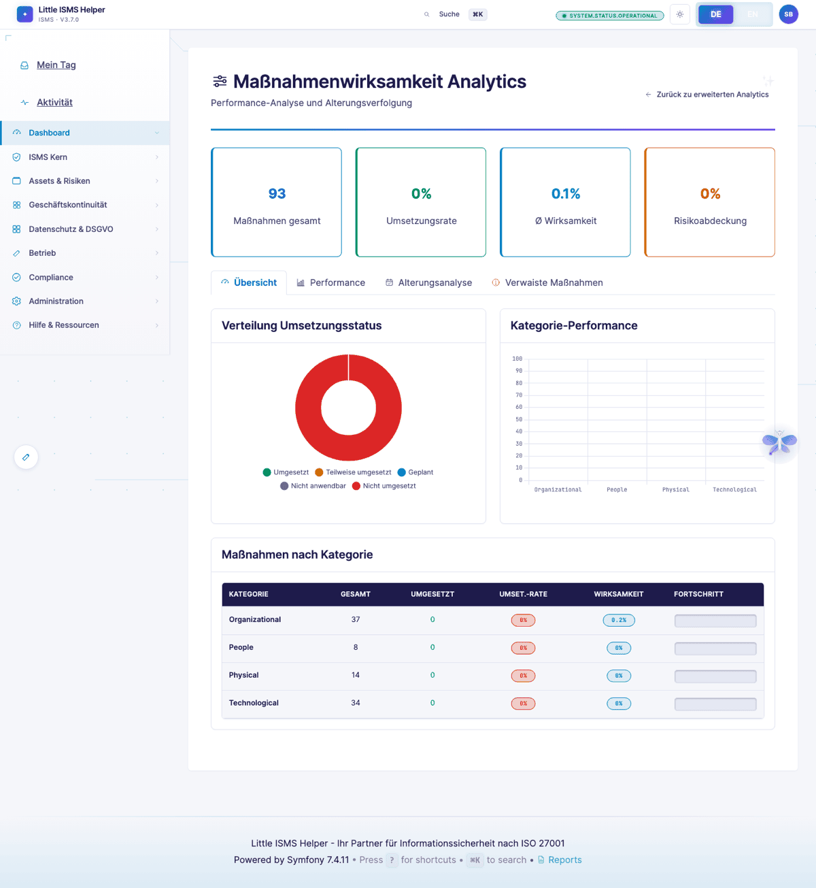

# Externer Auditor — Evidence statt Erzählungen

> **Wer:** Leitender Auditor einer akkreditierten Zertifizierungsstelle (ISO 27001, 27701, 22301, BSI IT-Grundschutz). ISO 19011 als Methodikrahmen.
> **Denkweise:** "Zeige es mir" statt "erzähl es mir". Konsistenz Policy↔SoA↔Umsetzung↔Wirksamkeit. Major-/Minor-NC, Observation, OFI.
> **Frust-Trigger:** Audit-Trail nicht manipulationssicher, kein Stichtags-Export, fehlende Versionierung, NC-Management ohne Ursachenanalyse-Feld.
>
> Volle Persona-Definition: [`.claude/skills/persona-auditor-external`](../../.claude/skills/persona-auditor-external/)

[← Zurück zur Übersicht](README.md)

---

## Auditor-Dashboard

Rollen-spezifische Sicht für externe Prüfer mit Lese-Zugriff. Audit-Programm-Status, anstehende Findings, Document-Updates seit letztem Audit.

Zugang über `ROLE_AUDITOR` — ein dedizierter Read-Only-Modus mit Audit-Freeze schützt die Live-Daten während der Stichprobenprüfung.

---

## SoA-Snapshot zum Stichtag

Statement of Applicability zum Audit-Stichtag eingefroren. PDF-Export mit Versionsstand und SHA256-Prüfsumme.

> *"Bitte zeigen Sie mir Evidence zu Control A.5.1 für den Zeitraum Q1–Q3."*

Pro Control sichtbar: Anwendbarkeitsbegründung, Wirksamkeitsmessung-Historie, verknüpfte Risiken, verknüpfte Nachweise (Versions-getaggt). Gegenproben über Audit-Log möglich.

---

## Audit-Freeze

Read-Only-Modus aktiv während externer Audit. Keine Live-Datenänderung möglich, alle Snapshots versioniert mit SHA256.

ISO 27001 Klausel 9.2 (interne Audits) und Klausel 9.3 (Managementbewertung) verlangen reproduzierbare Evidence — der Freeze macht den Stichprobenstand zum Audit-Tag zwei Monate später noch nachvollziehbar.

---

## Audit-Log

Manipulationssicher, gefiltert nach Wer/Wann/Was. Klausel 7.5 (dokumentierte Information) und 9.1 (Überwachung).

> *"Wer hat das freigegeben und wann? Das Risiko ist seit 18 Monaten auf 'akzeptiert' — wer hat die Akzeptanz wann erneuert?"*

Stichprobenfähig, exportierbar als PDF mit Audit-Trail-Signatur.

---

## Management-Review

Inputs/Outputs strukturiert nach ISO-27001-Klausel 9.3 — Performance-Indikatoren, Audit-Ergebnisse, Risikoänderungen, Verbesserungsvorschläge, Beschlüsse.

> *"Wo ist der Nachweis, dass die Managementbewertung gemäß 9.3 stattfand?"*

Verknüpfung mit Beschlüssen-Tracking — wenn ein Beschluss "Maßnahme bis Q3" lautet, ist der Status in der nächsten Review-Sitzung wieder zu sehen.

---

## Control-Effektivitäts-Tracking

Wirksamkeitsmessung pro Control über Zeit. Klausel 9.1 (Überwachung, Messung, Analyse, Bewertung).

> *"Wie messen Sie die Wirksamkeit dieses Controls?"*

Pro Control: Messmethodik, Häufigkeit, letzte Ergebnisse, Trend, Verantwortlicher. Wenn die ISB hier Daten pflegt, ist die Audit-Vorbereitung halb erledigt.

---

## Was der Auditor hier nicht findet (und vermisst)

Aus der [Persona-Definition](../../.claude/skills/persona-auditor-external/SKILL.md):

- **Point-in-Time-Sicht** für jede Entity (heute nur SoA-Freeze; auch Risikoregister, Asset-Register, Document-Lenkung sollten Stichtags-Snapshot haben).
- **Ursachenanalyse-Feld** strukturiert in NC-Detail (heute teils Freitext-Beschreibung).
- **Erzwungene Genehmigungs-/Review-Zyklen** in Dokumentenlenkung — Klausel 7.5 verlangt expliziten Aktualisierungs-Workflow.
- **Audit-Bericht-Export** mit Major-/Minor-/Observation-Klassifikation als PDF.

→ Roadmap-Items aus Auditor-Sicht — die teuersten Lücken, weil ein einziger NC-Befund Zertifikat verzögern kann.

---

[← Risk-Owner](risk-owner-business.md) · [Übersicht](README.md) · [Nächste Persona: Tool-Tester →](tool-tester.md)
