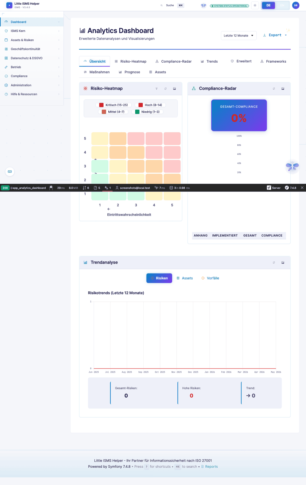

# CISO-Sicht — Executive in 30 Sekunden

> **Wer:** CISO mit 10+ Jahren Security-Verantwortung, Vorstandsberichterstattung, Budget- und Personalverantwortung.
> **Denkweise:** Risk/Cost/Benefit vor Compliance-Perfektion. Business-Enabler, nicht Blockierer.
> **Frust-Trigger:** Detailtiefe ohne Aggregation, fehlende Vergleiche (YoY, Benchmark), nicht quantifizierte Risiken.
>
> Volle Persona-Definition: [`.claude/skills/persona-ciso-executive`](../../.claude/skills/persona-ciso-executive/)

[← Zurück zur Übersicht](README.md)

---

## CISO-Dashboard

Time-to-Insight unter 30 Sekunden. Ein Klick, Status klar.

> *"Wo steht unser Reifegrad vs. letztes Quartal? Wie viele offene Top-Risiken trage ich aktuell im Report an den Vorstand? Kann ich das ohne ISB-Zuarbeit selbst ziehen?"*

KPIs aggregiert. Kein Klausel-Wortlaut, kein Field-Level-Detail — das macht die ISB.

---

## Board-Dashboard

Vorbereitet für Vorstandssitzung. Heatmap, Top-Risiken, Compliance-Ampel.

NIS2-Geschäftsleiter-Verantwortung (§ 38 BSIG-neu) und DORA Art. 5 verlangen, dass die Geschäftsleitung Cybersicherheitsrisiken überwacht und die getroffenen Massnahmen dokumentiert hat. Diese Sicht liefert den Nachweis.

---

## Analytics-Dashboard

Tieferer Einblick — Reifegrad-Trend, Control-Effektivität, Compliance-Coverage über Frameworks.

> *"Was kostet uns Nicht-Umsetzung von Control X?"*

Der CISO will quantifizieren — ALE/EL/Restrisiko-€ ist Roadmap-Thema. Aktueller Stand: Control-Coverage und Reifegrad als KPI-Trend.

---

## Risk-Forecast

Risikoportfolio-Verlauf über Zeit. Trend-Chart Restrisiko-Volumen.

Für CRQ/ALE-Diskussionen mit dem CFO: "Welcher Treatment-Plan reduziert ALE am meisten pro €?" — heute qualitativ über Trend, quantitativ als Dev-Item.

---

## Executive Report

One-Pager-Export für Vorstandsvorlage. Logo, Compliance-Status, Top-Findings, getroffene Massnahmen.

PDF-Export auf Knopfdruck. Kein manueller Excel-Stress vor jeder Sitzung.

---

## Management-Reports-Hub

Alle CISO-relevanten Reports in einem Cockpit: Portfolio, Executive, Group/Konzern, Compliance-Gap.

Auch die Scheduled-Reports laufen über diese Hub-Seite — wöchentlicher Vorstandsversand vorkonfiguriert, kein manueller Versand.

---

## Was der CISO hier nicht findet (und vermisst)

Aus der [Persona-Definition](../../.claude/skills/persona-ciso-executive/SKILL.md):

- **Finanzielle Risiko-Bewertung** (Annual Loss Expectancy, EL, ALE in €) — heute qualitative Matrix.
- **Szenario-Simulation** ("was wenn wir Control Y nicht umsetzen?").
- **Verknüpfung Kontrollen ↔ Budget ↔ FTE** — Lizenz-/Betriebskosten-Sicht.
- **Branchenbenchmarks** (z.B. NIST CSF Tier-Vergleich vs. Peer-Group).

→ Roadmap-Items aus CISO-Sicht, getriggert über die Persona im Roadmap-Review.

---

[← ISB-Sicht](isb-practitioner.md) · [Übersicht](README.md) · [Nächste Persona: Compliance-Manager →](compliance-manager.md)
