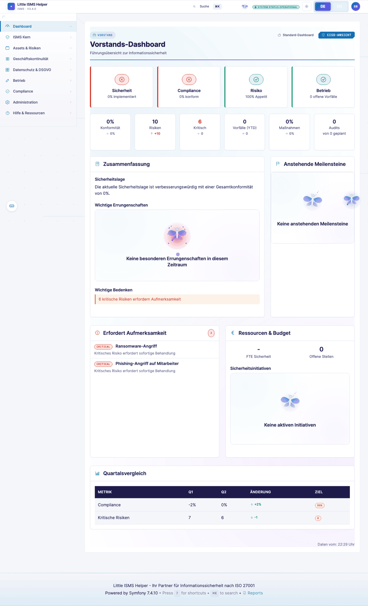
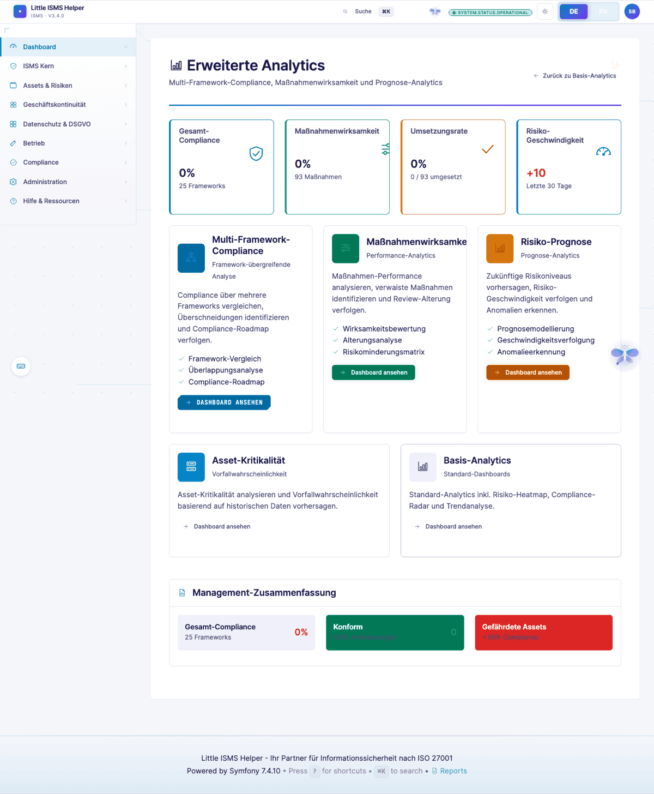
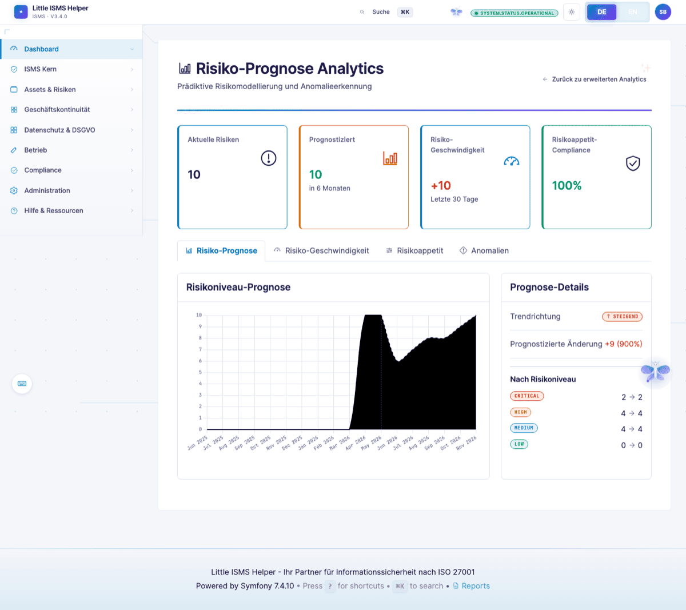
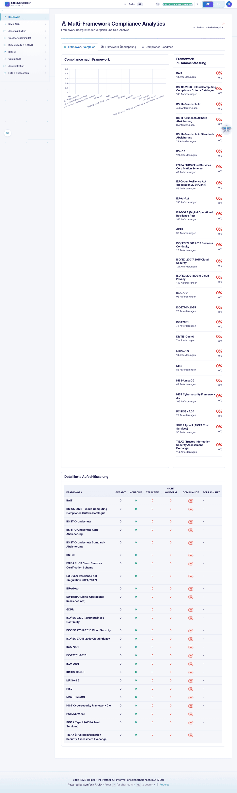
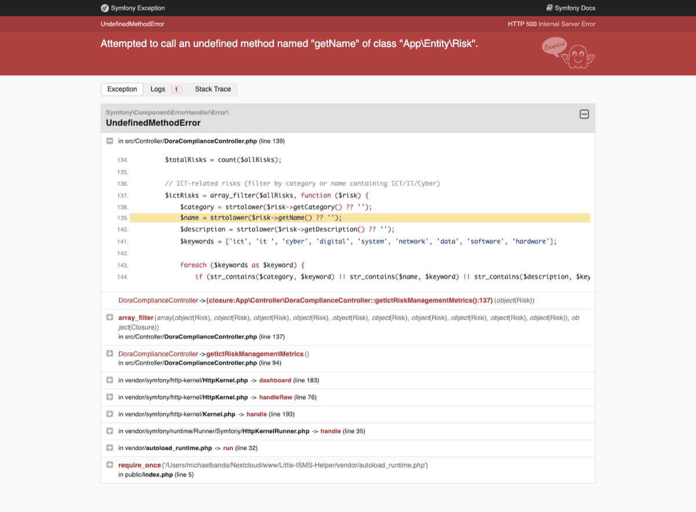
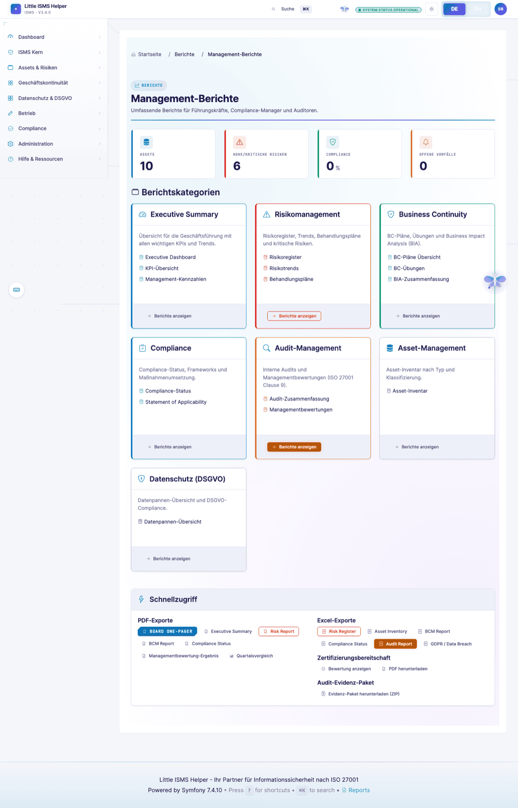
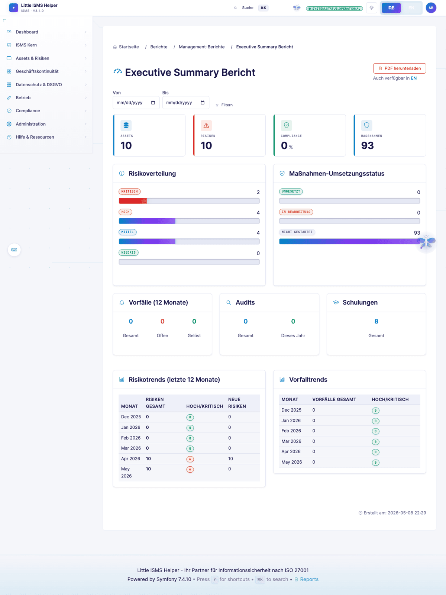

# CISO-Sicht — Executive in 30 Sekunden

> **Wer:** CISO mit 10+ Jahren Security-Verantwortung, Vorstandsberichterstattung, Budget- und Personalverantwortung.
> **Denkweise:** Risk/Cost/Benefit vor Compliance-Perfektion. Business-Enabler, nicht Blockierer.
> **Frust-Trigger:** Detailtiefe ohne Aggregation, fehlende Vergleiche (YoY, Benchmark), nicht quantifizierte Risiken.
>
> Volle Persona-Definition: [`.claude/skills/persona-ciso-executive`](../../.claude/skills/persona-ciso-executive/)

[← Zurück zur Übersicht](README.md)

---

## CISO-Dashboard

Time-to-Insight unter 30 Sekunden. KPIs aggregiert. Kein Klausel-Wortlaut, kein Field-Level-Detail — das macht die ISB.

> *"Wo steht unser Reifegrad vs. letztes Quartal? Wie viele offene Top-Risiken trage ich aktuell im Report an den Vorstand?"*

---

## Board-Dashboard

Vorbereitet für Vorstandssitzung. Heatmap, Top-Risiken, Compliance-Ampel. NIS2-Geschäftsleiter-Verantwortung (§ 38 BSIG-neu) und DORA Art. 5 Nachweis.

---

## Analytics-Advanced

Vertiefung — Reifegrad-Trend, Control-Effektivität, Compliance-Coverage über alle Frameworks.

---

## Risk-Forecast

Risikoportfolio-Verlauf über Zeit. Trend-Chart Restrisiko-Volumen.

> *"Welcher Treatment-Plan reduziert ALE am meisten pro €?"* — heute qualitativ über Trend, quantitativ als Roadmap-Item.

---

## Compliance-Frameworks-Radar

Status pro Framework auf einem Blick. Reifegrad, Coverage, offene Lücken.

---

## DORA-Cockpit

ICT-Resilienz-Status, Drittdienstleister-Register, Vorfall-Meldepflichten gemäß EU-DORA Art. 5–33.

---

## Management-Reports-Hub

Alle CISO-relevanten Reports zentral.

---

## Executive Report

One-Pager-Export für Vorstandsvorlage. Logo, Compliance-Status, Top-Findings, Massnahmen.

PDF-Export auf Knopfdruck. Kein manueller Excel-Stress vor jeder Sitzung.

---

## Querverweise

- **SoA + Risikoregister** (Detail-Sicht): [ISB-Sicht](isb-practitioner.md)
- **Cross-Framework-Mappings**: [Compliance-Manager-Sicht](compliance-manager.md)
- **Audit-Trail für Haftungs-Doku**: [Auditor-Sicht](auditor-external.md)

---

## Was der CISO hier vermisst

Aus der [Persona-Definition](../../.claude/skills/persona-ciso-executive/):

- **Finanzielle Risiko-Bewertung** (ALE, EL, Restrisiko in €) — heute qualitativ
- **Szenario-Simulation** ("was wenn wir Control Y nicht umsetzen?")
- **Verknüpfung Kontrollen ↔ Budget ↔ FTE**
- **Branchenbenchmarks** (NIST CSF Tier-Vergleich vs. Peer-Group)

---

[← ISB](isb-practitioner.md) · [Übersicht](README.md) · [Nächste: Compliance-Manager →](compliance-manager.md)
