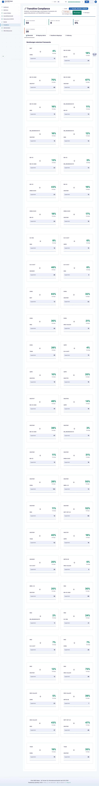
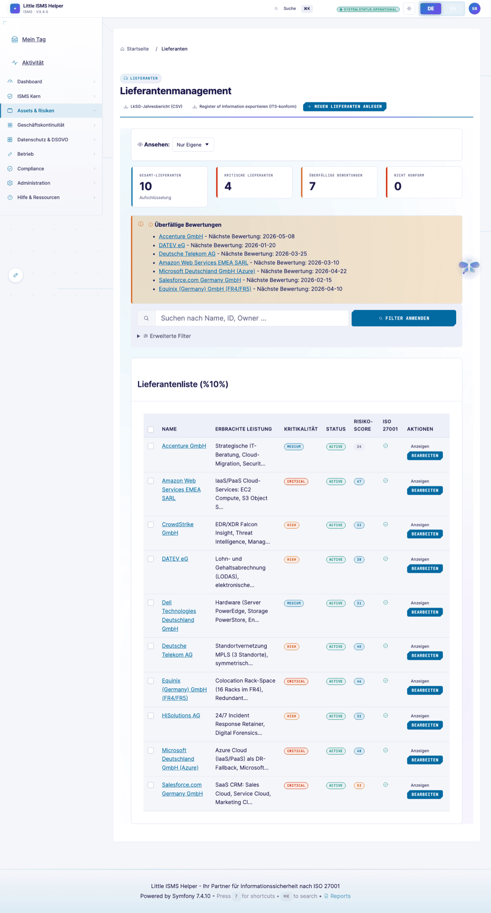
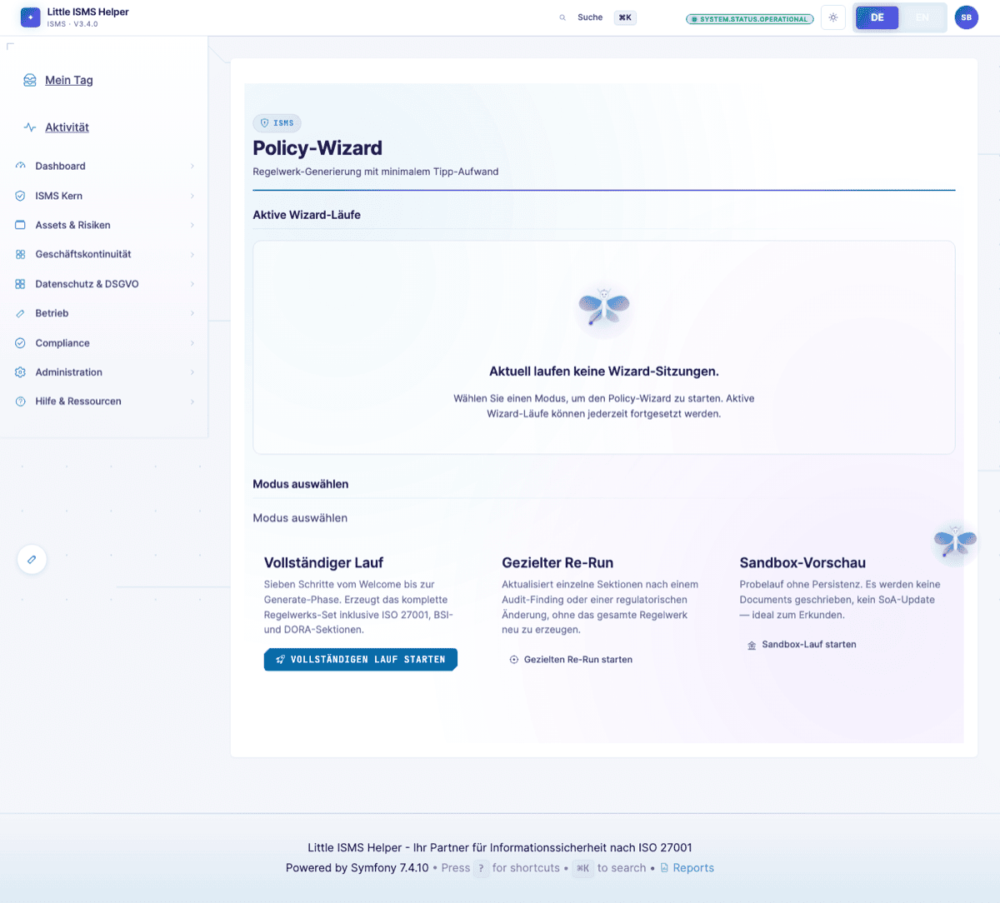
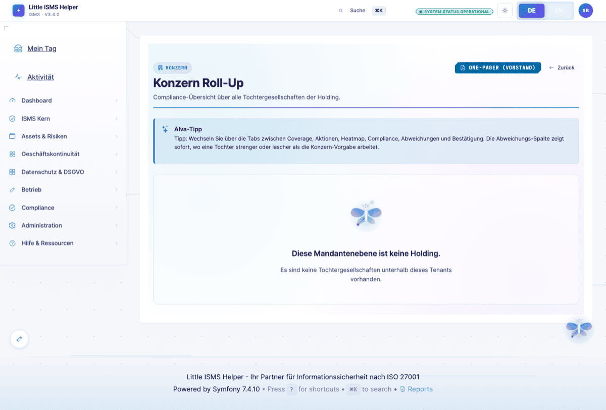
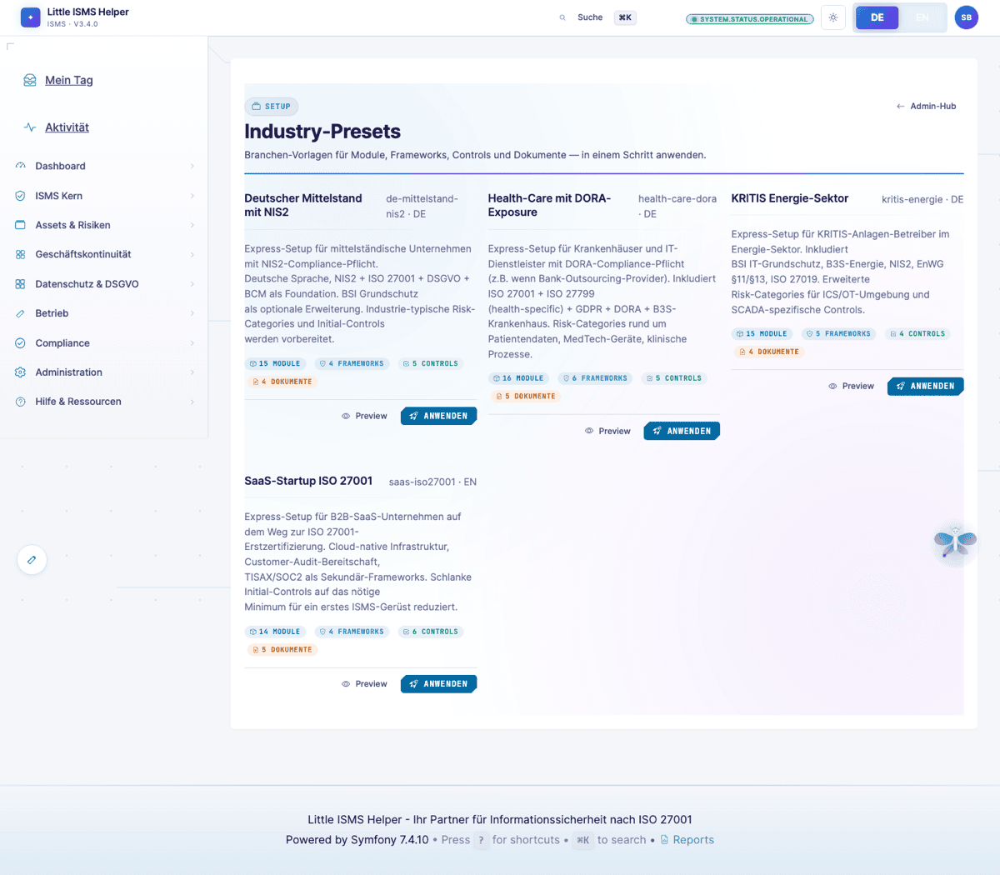
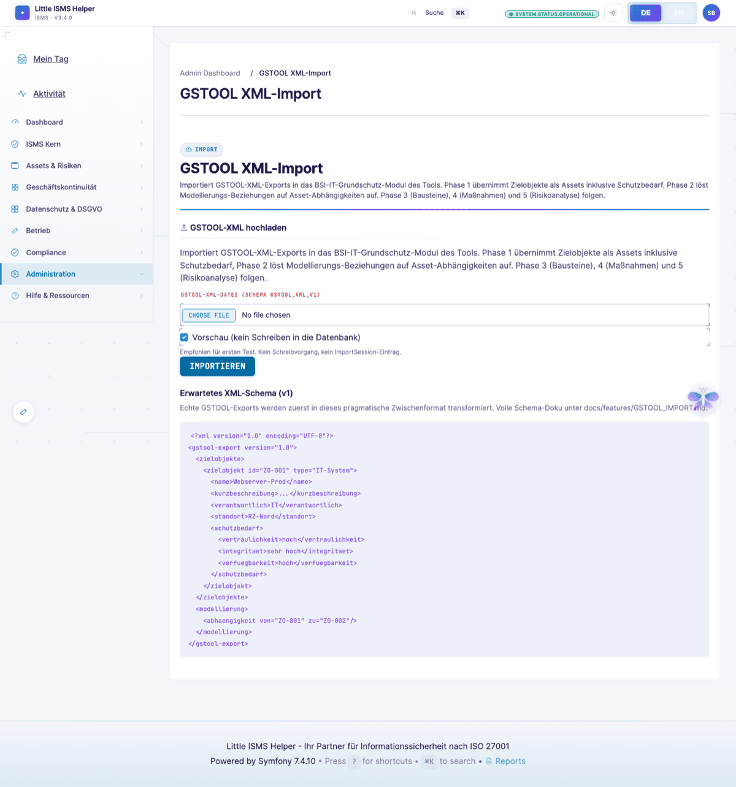
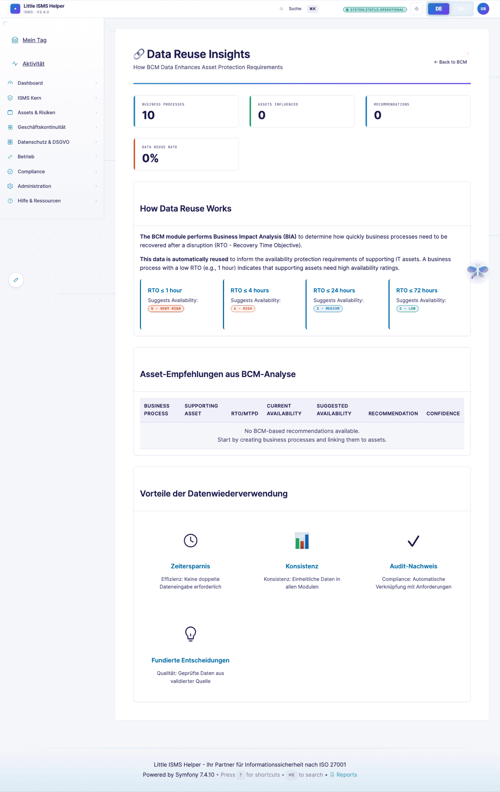

# Compliance-Manager-Sicht — Framework-Portfolio + Reuse

> **Wer:** Head of GRC oder Leiter IT-Compliance, 6–12 Jahre Erfahrung, dem CISO unterstellt, leitet 2–6-köpfiges Compliance-Team.
> **Denkweise:** Effizienz + Effektivität. Data-Reuse obsessiv. Frameworks als Venn-Diagramm, nicht als Stapel.
> **Frust-Trigger:** Jede Form von Dateneingabe-Redundanz. Framework-spezifische Silos ohne Brücken. Fehlende Mappings, wo der Markt sie hat.
>
> Volle Persona-Definition: [`.claude/skills/persona-compliance-manager`](../../.claude/skills/persona-compliance-manager/)

[← Zurück zur Übersicht](README.md)

---

## Compliance-Übersicht

Aktive Frameworks im Portfolio. ISO 27001:2022, NIS2, EU-DORA, GDPR, BSI IT-Grundschutz, BSI C5:2026, TISAX, MRIS und mehr — bei diesem Tenant 25+ Frameworks.

> *"Wir sind 27001-zertifiziert und jetzt NIS2-pflichtig geworden. Welche NIS2-Art.-21-Anforderungen sind durch bestehende 27001-Controls bereits erfüllt?"*

---

## Compliance-Wizard

Geführtes Onboarding eines neuen Frameworks. Branchen-Preset wählen, Reuse-Vorschau, Gap-Bericht, Aktionsliste mit FTE-Schätzung.

> *"Onboarding eines neuen Frameworks darf nicht > 20 FTE-Tage kosten, wenn 70 % Überlappung besteht."*

---

## Cross-Framework-Mapping

Welche Anforderungen verschiedener Frameworks decken sich? Welche eines Framework lassen sich durch Controls aus einem anderen erfüllen?

ISO-27001-Controls mappen zu NIS2-Art.-21-Anforderungen (~70% Überlappung), DORA-ICT-Risk (~60%), TISAX (~85%).

---

## Transitive Compliance

Vererbung im Detail: Control A erfüllt Anforderung B erfüllt Anforderung C. Die Kette macht Reuse messbar.

---

## Data-Reuse-Heatmap

Welche Daten werden wie oft framework-übergreifend wiederverwendet? KPI: eingesparte FTE-Tage durch Reuse.

---

## Mapping-Hub

Mappings als eigenständige, versionierte Artefakte. Library unter [`fixtures/library/mappings/`](../../fixtures/library/mappings/) als YAML — git-versioniert, diff-fähig, community-PR-fähig.

---

## Mapping-Wizard

Cross-Mappings nicht manuell, sondern wizard-gesteuert. Vorschläge auf Basis von Norm-Wortlaut und vorhandenen Controls.

---

## Anforderungs-Liste

Alle Anforderungen aller Frameworks in einer durchsuchbaren Tabelle. Pro Anforderung: Status, Erfüllt-durch, Owner.

---

## Lieferanten

Einmal gepflegt, deckt DORA-Drittdienstleister + ISO 27001 A.5.19–22 + GDPR Art. 28 gleichzeitig ab.

---

## Policy-Wizard

Geführte Policy-Erstellung pro Framework (ISO, NIS2, DORA, BSI). 7 Schritte vom Scope bis zum Sign-Off. Sandbox-Modus, Targeted-Re-Run, Konzern-Push-Down.

Dazu der **Konzern-Rollup**: Policy-Coverage über alle Tochtergesellschaften, One-Pager-PDF-Export für Vorstand.

---

## Industry-Presets-Admin

Branchen-Bundles als versionierte Artefakte. KMU-Mittelstand, KRITIS, Healthcare, B2C-SaaS, OT/IEC 62443. Aktivieren ein Preset → lädt Frameworks + Mappings + initiale Controls auf einen Schlag.

---

## GSTOOL-XML-Import

5-phasiger Migrationspfad für Verinice/BSI-Grundschutz-Profile (Zielobjekte → Bausteine → Maßnahmen → Risikoanalyse).

---

## BCM-Data-Reuse-Insights

Wo werden BCM-Daten (Geschäftsprozesse, BIA, BC-Pläne) bereits framework-übergreifend genutzt? Effektivitäts-Lens für BCM-Investitionen.

---

## Querverweise

- **DORA-Cockpit + Compliance-Ampel** (CISO-View): [CISO-Sicht](ciso-executive.md)
- **Modul-Aktivierung**: [Admin → Module-Verwaltung](../sichtwechsel/img/admin/modules-overview.png)
- **Audit-Beweissammlung**: [Auditor-Sicht](auditor-external.md)

---

## Was der Compliance-Manager vermisst

Aus der [Persona-Definition](../../.claude/skills/persona-compliance-manager/):

- **Vererbungs-Visualisierung** (transitive Abdeckung als Graph)
- **Auto-Vorschläge** beim Framework-Onboarding (heute Wizard, nicht aggressiv genug)
- **Bulk-Operationen auf Framework-Ebene** ("alle NIS2-relevanten Controls als Pflicht markieren")
- **API-Export** für externe BI-Tools (Reuse-Statistik in Tableau)

---

[← CISO](ciso-executive.md) · [Übersicht](README.md) · [Nächste: Junior-Implementer →](implementer-junior.md)
