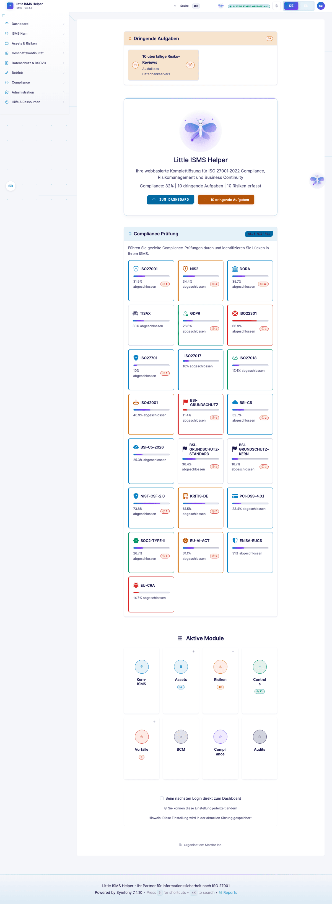
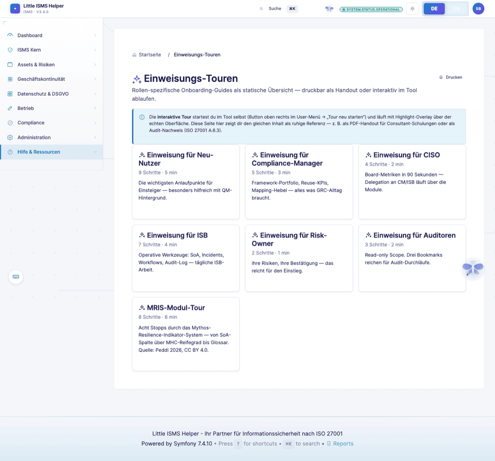
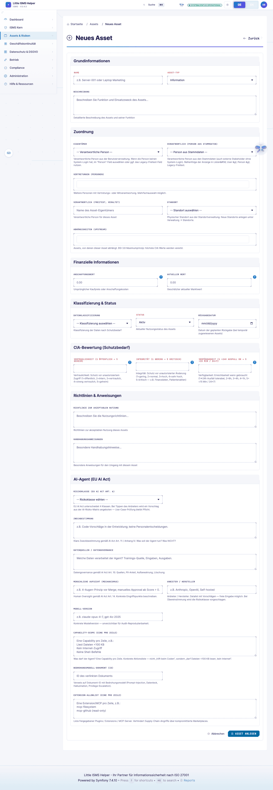
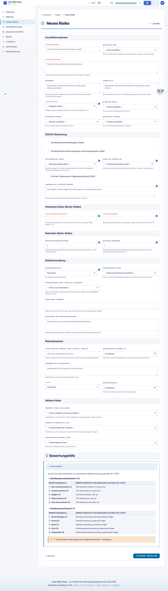

# Junior-Implementer-Sicht — Geführte Pfade für Quereinsteiger

> **Wer:** IT-Admin oder QM-Beauftragter mit ISO-9001-Hintergrund. Seit Monaten auf 27001-Thema gesetzt. Kein tiefes Normverständnis, kein eingespieltes Vokabular.
> **Denkweise:** "Was trage ich wo ein?" vor "Warum?". Sucht 9001-Analogien. Vertraut Tool-Defaults.
> **Frust-Trigger:** Fachjargon ohne Erklärung, leere Dropdowns, "Trust-me-bro"-Felder, zu viele optionale Felder.
>
> Volle Persona-Definition: [`.claude/skills/persona-implementer-junior`](../../.claude/skills/persona-implementer-junior/)

[← Zurück zur Übersicht](README.md)

---

## Welcome-Screen

Erste Anmeldung. Hier wird der Junior-Implementer entweder mitgenommen oder verloren.

Statt direkt ins leere Dashboard kippen: Einstiegspfad mit Module-Übersicht und "Begrüßung nicht mehr anzeigen"-Option.

---

## Hilfe & Tour

Tour-Modus für Onboarding. Alva (die ISMS-Begleiterin) führt durch das Tool. Persona-spezifische Tour-Inhalte sind admin-pflegbar.

---

## Asset-Anlage

Form mit Pflichtfeld-Markierung, Tooltip pro Feld, Beispiel-Input.

> *"Was ist der Unterschied zwischen Asset und Bedrohung? Bei 9001 hieß das einfach Prozess, warum hier drei Felder?"*

Tooltips erklären Norm-Begriffe in 1–2 Sätzen, nicht in Klausel-Paragraphen.

---

## Risiko-Anlage

Kurz-Form mit den drei Pflichtangaben (Bedrohung, Schwachstelle, Auswirkung) und Auto-Verknüpfung zum Asset.

---

## Setup-Wizard

Der erste Kontakt mit dem Tool: 11-Schritte-Setup. Voller Walkthrough mit Screenshots aller Schritte: [**Quickstart-Guide**](../QUICKSTART.md).

> *"Ich weiß nicht was ich hier reinschreiben soll."* — der Wizard reduziert genau diese Momente.

---

## Querverweise

- **Setup-Wizard im Detail**: [Quickstart](../QUICKSTART.md)
- **Compliance-Wizard für Framework-Onboarding**: [Compliance-Manager-Sicht](compliance-manager.md)
- **Risiko-Register danach**: [ISB-Sicht](isb-practitioner.md)

---

## Was der Junior vermisst

Aus der [Persona-Definition](../../.claude/skills/persona-implementer-junior/):

- **Onboarding-Wizard nach Reihenfolge ISMS-Aufbau** ("Erstelle jetzt: Kontext → Assets → Risiken → SoA")
- **9001→27001-Bridge-View**: "Du kennst CAPA — hier heißt das Maßnahme. Du kennst Prozesslandkarte — hier heißt das SoA"
- **Empty-States mit konkreter CTA** auf jeder Listen-Seite
- **Beispieldaten-Import** als ein-Klick-Schalter im Setup-Wizard

Detaillierter Junior-Walkthrough (textuell): [JUNIOR_IMPLEMENTER_WALKTHROUGH.md](../JUNIOR_IMPLEMENTER_WALKTHROUGH.md)

---

[← Compliance-Manager](compliance-manager.md) · [Übersicht](README.md) · [Nächste: Risk-Owner →](risk-owner-business.md)
