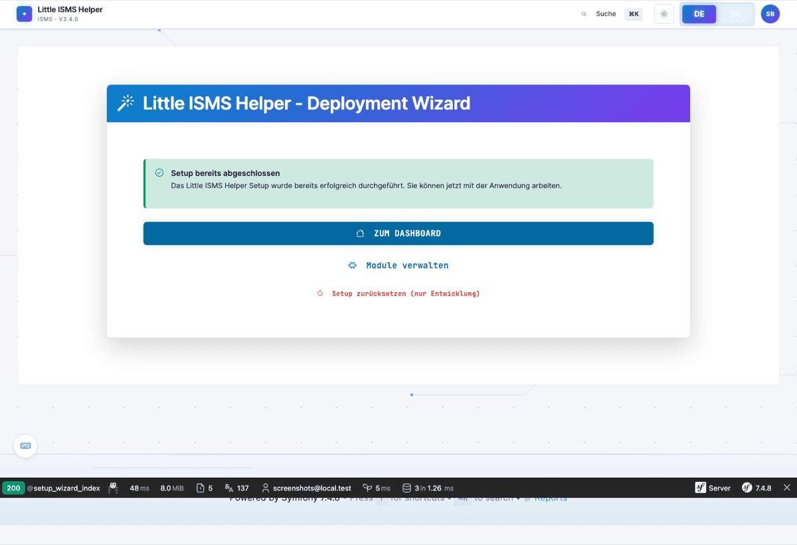
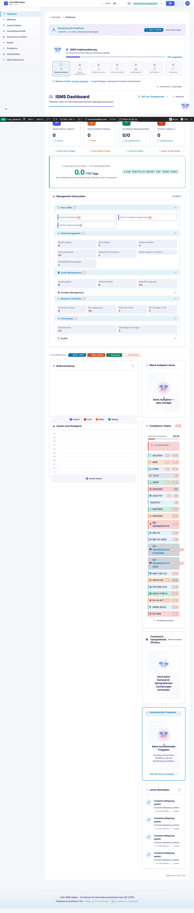

# Junior-Implementer-Sicht — Geführte Pfade für Quereinsteiger

> **Wer:** IT-Admin oder QM-Beauftragter mit ISO-9001-Hintergrund. Seit Monaten auf 27001-Thema gesetzt. Kein tiefes Normverständnis, kein eingespieltes Vokabular.
> **Denkweise:** "Was trage ich wo ein?" vor "Warum?". Sucht 9001-Analogien. Vertraut Tool-Defaults.
> **Frust-Trigger:** Fachjargon ohne Erklärung, leere Dropdowns, "Trust-me-bro"-Felder, zu viele optionale Felder.
>
> Volle Persona-Definition: [`.claude/skills/persona-implementer-junior`](../../.claude/skills/persona-implementer-junior/)

[← Zurück zur Übersicht](README.md)

---

## Welcome-Screen

Erste Anmeldung. Das ist der Moment, in dem der Junior das Tool entweder lieb gewinnt oder aufgibt.

Statt direkt ins leere Dashboard kippen: Einstiegspfad mit Module-Übersicht und "Begrüßung nicht mehr anzeigen"-Option. Aktive-Module-Kacheln zeigen, was im Tool *aktuell* zu tun ist — keine alphabetische Mega-Menü-Wand.

---

## Setup-Wizard

Geführtes Onboarding für die Erstkonfiguration. Schritt-für-Schritt durch Tenant-Daten, Branche, Frameworks.

Branchen-Preset (z.B. "Mittelstand-NIS2", "BaFin-Financial", "KRITIS-Energie") lädt vorgeschlagene Frameworks, Mappings und initiale Controls — der Junior muss nicht entscheiden, was 27001 ist.

> *"Ich weiß nicht was ich hier reinschreiben soll."* — der Wizard reduziert genau diese Momente.

---

## Asset-Anlage

Form mit Pflichtfeld-Markierung, Tooltip pro Feld, Beispiel-Input.

> *"Was ist der Unterschied zwischen Asset und Bedrohung? Bei 9001 hieß das einfach Prozess, warum hier drei Felder?"*

Tooltips erklären Norm-Begriffe (z.B. "Asset = ISO 27000:2022 Term 3.1: Anything that has value to the organization") in 1–2 Sätzen, nicht in Klausel-Paragraphen.

---

## Risiko-Anlage

Kurz-Form mit den drei Pflichtangaben (Bedrohung, Schwachstelle, Auswirkung) und einer Auto-Verknüpfung zum Asset.

Das geführte Wizard-Variante (mehrere Schritte, je 2-3 Felder pro Step) ist als Alternative aufrufbar — für Junior-Implementer realistisch im Tagesgeschäft.

---

## Hauptdashboard

Nach erstem Setup. Zeigt Aufgaben, Pending-Reviews, Dringend-zu-tun.

Junior sieht: "Was muss ich heute machen?" — nicht: "Hier sind 47 Klausel-Status-Indikatoren, viel Spaß."

---

## Hilfe & Tour

Tour-Modus für Onboarding. Alva (die ISMS-Fee/Maskotchen-Figur) führt durch das Tool.

Persona-spezifische Tour-Inhalte (Junior, ISB, CISO, Risk-Owner — siehe `app:admin_tour_content_*` Routes) erlauben mehrere Touren parallel zu pflegen.

---

## Was der Junior hier nicht findet (und vermisst)

Aus der [Persona-Definition](../../.claude/skills/persona-implementer-junior/SKILL.md):

- **Onboarding-Wizard nach Reihenfolge ISMS-Aufbau** ("Erstelle jetzt: Kontext → Assets → Risiken → SoA").
- **9001→27001-Bridge-View**: "Du kennst CAPA aus 9001 — hier heißt das Maßnahme. Du kennst Prozesslandkarte — hier heißt das SoA."
- **Empty-States mit konkreter CTA** auf jeder Listen-Seite (heute teils nur "Keine Einträge" ohne Anlege-Vorschlag).
- **Beispieldaten-Import** als ein-Klick-Schalter im Setup-Wizard für Lernumgebungen.

→ Roadmap-Items getriggert über die Junior-Persona im UX-Review.

Mehr Detail: [Junior-Implementer-Walkthrough (textuell)](../JUNIOR_IMPLEMENTER_WALKTHROUGH.md).

---

[← Compliance-Manager](compliance-manager.md) · [Übersicht](README.md) · [Nächste Persona: Risk-Owner →](risk-owner-business.md)
