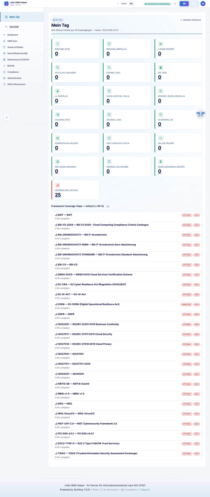
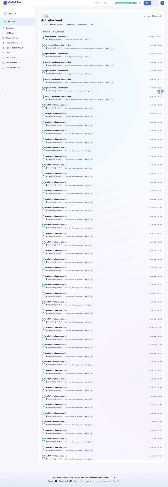
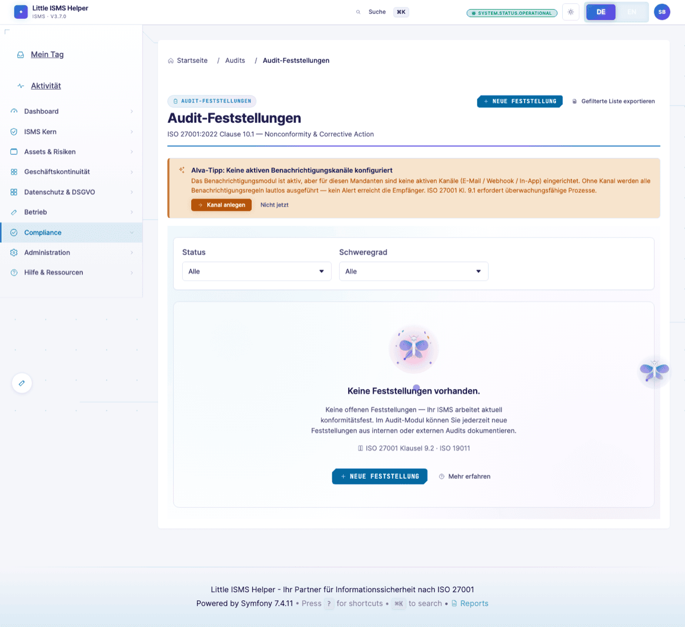

# ISB-Sicht — Operative ISO-27001-Praxis

> **Wer:** Informationssicherheitsbeauftragte mit 5–10 Jahren Praxis, mehrere Zertifizierungen begleitet.
> **Denkweise:** Compliance first, Pragmatismus zweite. Jedes Feld muss "auditfest" sein.
> **Frust-Trigger:** Medienbrüche, fehlende Evidenzverknüpfung, nicht exportierbare Berichte, Audit-Log-Lücken.
>
> Volle Persona-Definition: [`.claude/skills/persona-isb-practitioner`](../../.claude/skills/persona-isb-practitioner/)

[← Zurück zur Übersicht](README.md)

---

## Erster Anlauf: Dashboard

Die ISB landet nach Login auf dem **Hauptdashboard**. Erwartung: "Was muss ich heute anschauen?" — überfällige Reviews, offene Maßnahmen, Risikoakzeptanzen ohne Ablaufdatum, Audit-Findings-Status.

> *"KPIs offen-überfällig direkt sichtbar. Drilldown auf Top-Risiken."*

---

## My-Day — Zentrale Aufgaben-Inbox

Aggregator über alle Module: anstehende Reviews, Maßnahmen-Fristen, eingehende Workflow-Freigaben, neue Findings. Eine Stelle, ein Tag.

> *"Vor My-Day musste ich drei Module manuell durchklicken um den Stand des Tages zu kennen."*

---

## Activity-Feed

Chronologischer Stream aller relevanten Aktivitäten — wer hat wann was angelegt/geändert/freigegeben. Audit-Log-Light für den Tagesüberblick.

---

## SoA — Statement of Applicability

Das Herzstück für die ISB. 93 ISO-27001-Annex-A-Controls, anwendbar/nicht-anwendbar, Begründung, Mapping zu Risiken und Nachweisen.

> *"Wo sehe ich die letzte Wirksamkeitsprüfung zu A.8.16? Kann ich den SoA-Stand zum Audit-Stichtag einfrieren?"*

Der Freeze-Mechanismus liegt unter `Audits → Audit-Freeze` und erlaubt einen Point-in-Time-Snapshot inklusive PDF-Export — Stichtags-belastbar für externe Audits.

---

## Risikoregister

Liste mit Treatment-Status, Restrisiko, Owner und Behandlungsplänen. Filterbar nach Schutzziel, Asset, Bereich.

Verknüpfung Risiko↔Asset↔Control↔Nachweis ist die operative Pflicht der ISB. Jedes Risiko zeigt im Detail Bedrohung, Schwachstelle, getroffene und geplante Maßnahmen.

---

## Audit-Findings

Strukturierte Befund-Liste statt Freitext. Severity (major-nc / minor-nc / observation / OFI), Status (open / in-progress / closed / wont-fix), finding-Nummer, Korrekturmaßnahme-Verknüpfung.

---

## Audit-Log

Manipulationssicher, gefiltert nach Wer/Wann/Was. Pflicht für ISO 27001 Klausel 9.1 (Überwachung) und 7.5 (dokumentierte Information).

> *"Ist das Audit-Log manipulationssicher? Wer hat das freigegeben und wann?"*

Statistik-Sub-View aggregiert Aktivität nach User/Entity/Aktion — Datenpunkt für Management-Review.

---

## Management-Review

Eingangs-/Ausgangsgrößen strukturiert nach ISO-27001-Klausel 9.3.

Vorbereitung des regelmäßigen Reviews mit Vorstand: Performance-Indikatoren, Audit-Ergebnisse, Risikoänderungen, Verbesserungsvorschläge — alles aus dem ISMS direkt verknüpft, kein paralleles Excel.

---

## Compliance-Übersicht

Multi-Framework-Sicht. Aktive Frameworks (ISO 27001, NIS2, DORA, GDPR, BSI-Grundschutz, …) mit Abdeckungsgrad und offenen Anforderungen.

Cross-Mapping zwischen Frameworks (z.B. ISO 27001 ↔ NIS2 Art. 21) bedeutet: ein Control deckt mehrere Anforderungen ab. Aufwand spart die ISB damit für die nächste Zertifizierung.

---

## Was die ISB hier nicht findet (und vermisst)

Aus der [Persona-Definition](../../.claude/skills/persona-isb-practitioner/SKILL.md):

- **Bulk-Operationen** über alle 50+ Risiken (Quartalsreassessment in einem Flow).
- **Reviewzyklen-Reminder** automatisiert (heute manuell anstoßen).
- **Soll/Ist-Trennung** bei Controls (Reife-Roadmap pro Control, nicht nur Status).
- **Restrisiko-Begründungs-Feld** mit Pflicht-Versionierung.

→ Roadmap-Items, getriggert über die ISB-Persona im laufenden Tool-Review.

---

[← Zurück zur Sichtwechsel-Übersicht](README.md) · [Nächste Persona: CISO →](ciso-executive.md)
