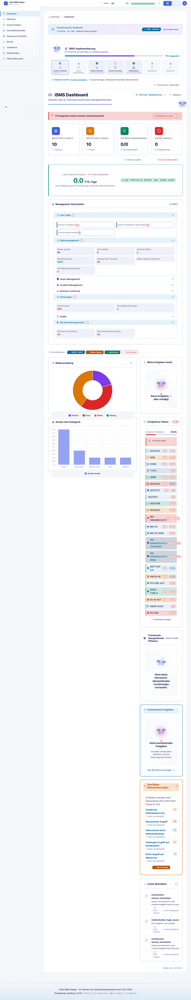
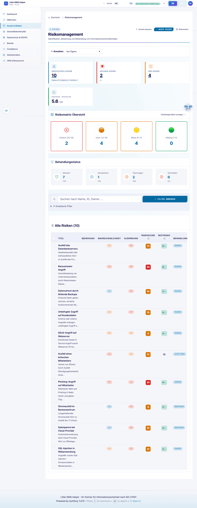
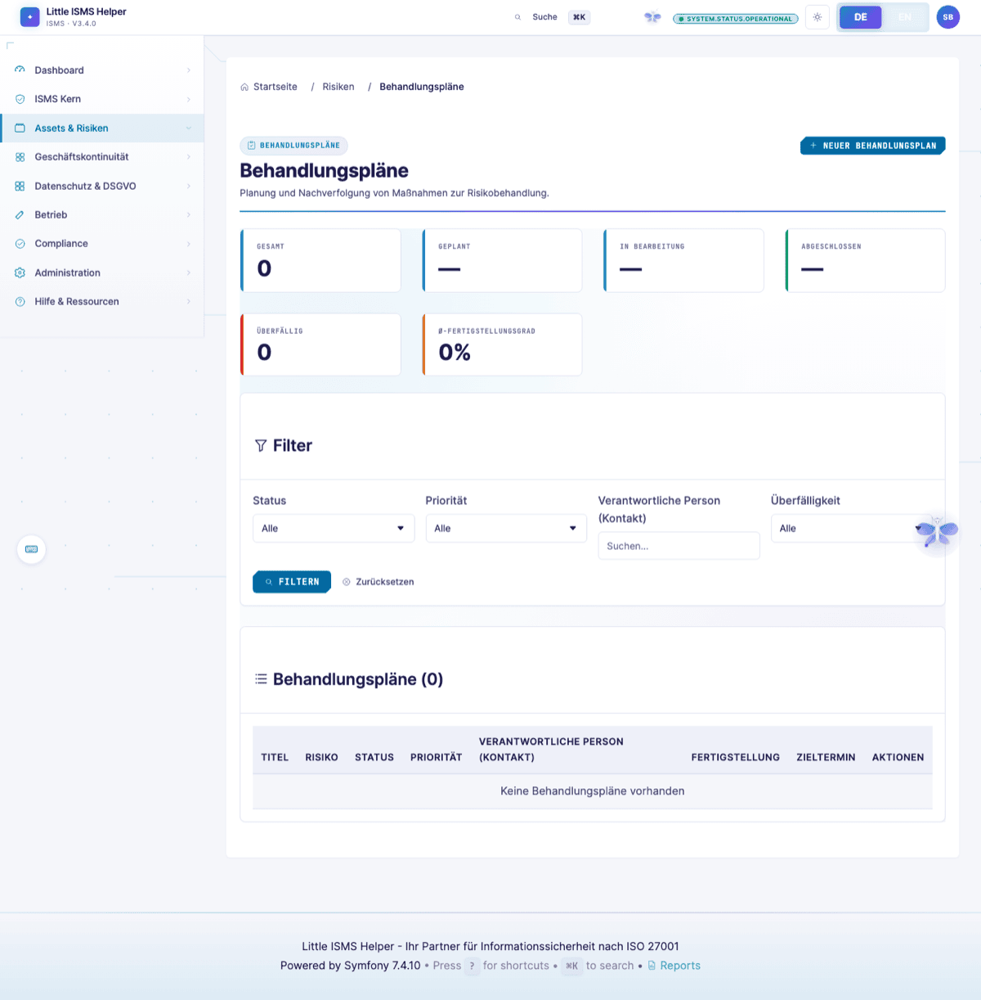
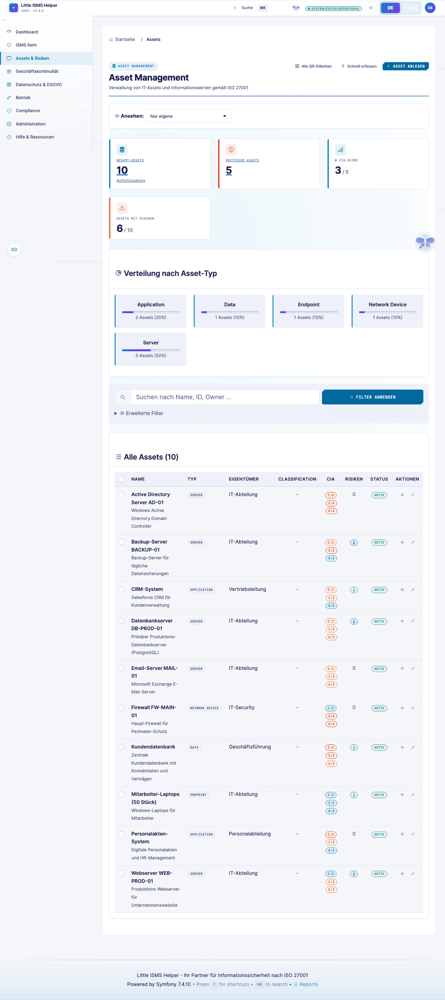

# ISB-Sicht — Operative ISO-27001-Praxis

> **Wer:** Informationssicherheitsbeauftragte mit 5–10 Jahren Praxis, mehrere Zertifizierungen begleitet.
> **Denkweise:** Compliance first, Pragmatismus zweite. Jedes Feld muss "auditfest" sein.
> **Frust-Trigger:** Medienbrüche, fehlende Evidenzverknüpfung, nicht exportierbare Berichte, Audit-Log-Lücken.
>
> Volle Persona-Definition: [`.claude/skills/persona-isb-practitioner`](../../.claude/skills/persona-isb-practitioner/)

[← Zurück zur Übersicht](README.md)

---

## Hauptdashboard

Die ISB landet hier nach Login. Erwartung: "Was muss ich heute anschauen?" — überfällige Reviews, offene Maßnahmen, Risikoakzeptanzen, Audit-Findings.

> *"KPIs offen-überfällig direkt sichtbar. Drilldown auf Top-Risiken."*

---

## SoA — Statement of Applicability

Das Herzstück. 93 ISO-27001-Annex-A-Controls mit Anwendbarkeit, Begründung, Mapping zu Risiken und Nachweisen. Freeze für Stichtag-Audit unter [Auditor → Audit-Freeze](auditor-external.md#audit-freeze).

> *"Wo sehe ich die letzte Wirksamkeitsprüfung zu A.8.16?"*

---

## Risikoregister

Filterbar, exportierbar. Treatment-Status, Restrisiko, Owner, Behandlungsplan-Verlinkung.

---

## Risikobehandlungsplan

Maßnahmen-Tracking pro Risiko. Owner, Frist, Status, Wirksamkeitstest.

---

## Asset-Register

Schutzobjekte mit CIA-Werten, Schutzbedarf, Abhängigkeiten. Verknüpfung zu Risiken und Controls.

---

## Control-Effektivität

Wirksamkeitsmessung pro Control über Zeit. ISO-27001-Klausel 9.1.

> *"Wie messen Sie die Wirksamkeit dieses Controls?"* — Antwort hier, mit Trend.

---

## Management-Review

Eingangs- und Ausgangsgrößen strukturiert nach Klausel 9.3.

---

## Querverweise

- **Compliance-Frameworks** (Cross-Mapping): [Compliance-Manager-Sicht](compliance-manager.md)
- **Audit-Log + Findings**: [Auditor-Sicht](auditor-external.md)
- **Risk-Owner-Freigaben**: [Risk-Owner-Sicht](risk-owner-business.md)

---

## Was die ISB hier vermisst

Aus der [Persona-Definition](../../.claude/skills/persona-isb-practitioner/):

- **Bulk-Operationen** über alle Risiken (Quartalsreassessment in einem Flow)
- **Reviewzyklen-Reminder** automatisiert (heute manuell)
- **Soll/Ist-Trennung** bei Controls (Reife-Roadmap pro Control)
- **Restrisiko-Begründungs-Feld** mit Pflicht-Versionierung

---

[← Übersicht](README.md) · [Nächste Persona: CISO →](ciso-executive.md)
