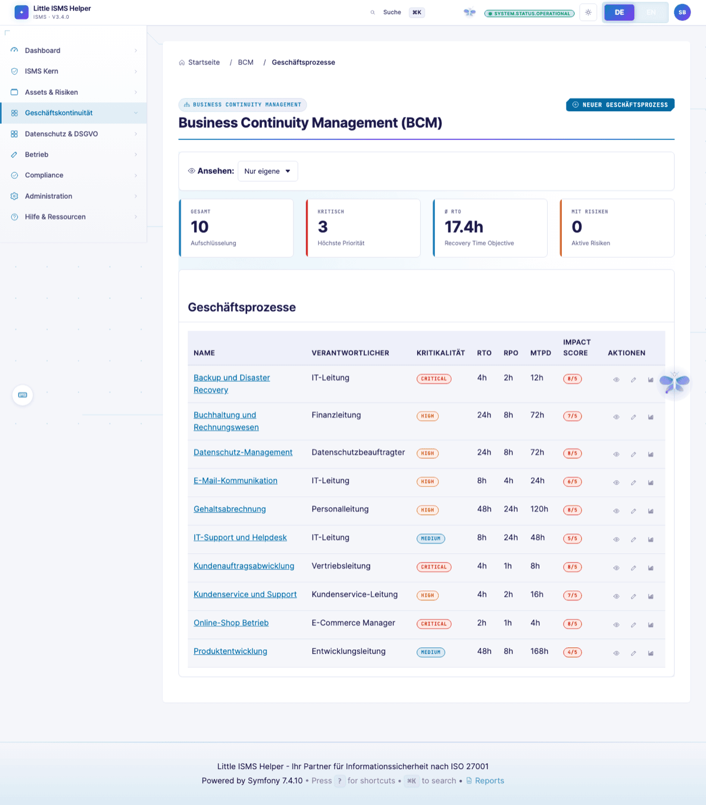
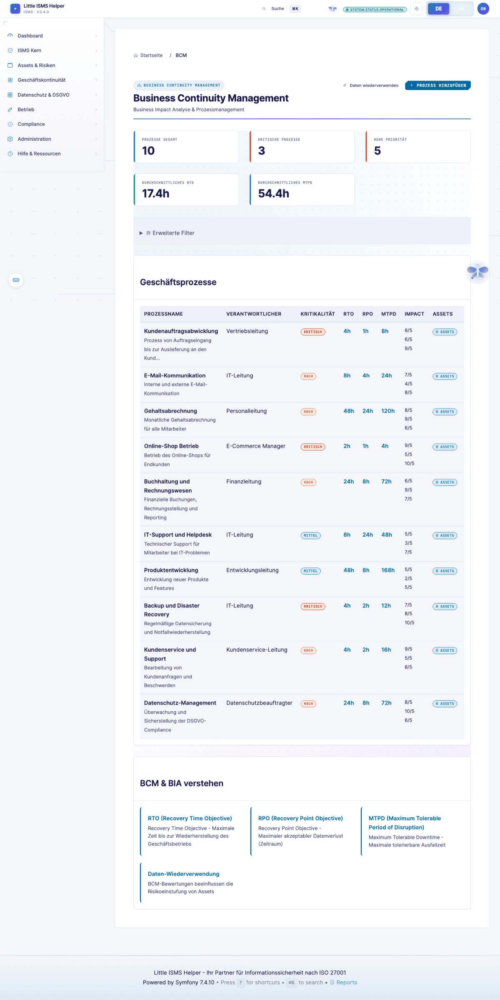
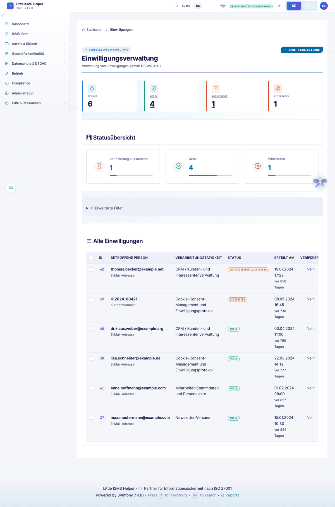

# Risk-Owner-Sicht — Business-Pfade, mobil, knapp

> **Wer:** Abteilungsleiter oder Prozessverantwortlicher (Vertrieb, Einkauf, HR, Produktion). Kein InfoSec-Hintergrund. Tool öffnet er/sie nur wenn er/sie muss.
> **Denkweise:** Geschäftsprozess steht über Security. Denkt in Umsatz, Kunden, Mitarbeitern, Lieferketten, Reputation. Risiko in € und Ausfalltagen.
> **Frust-Trigger:** Mehrseitige Formulare, InfoSec-Jargon, "Was soll ich hier entscheiden?".
>
> Volle Persona-Definition: [`.claude/skills/persona-risk-owner-business`](../../.claude/skills/persona-risk-owner-business/)

[← Zurück zur Übersicht](README.md)

---

## Workflows-Inbox

"Das musst DU jetzt tun." Mit Frist, Direktlink, Business-Kontext. Workflow-System löst Approvals event-driven aus (siehe [Workflow-Auto-Progression](../WORKFLOW_AUTO_PROGRESSION.md)).

> *"Ich hab 5 Minuten — was muss ich wissen?"*

---

## Geschäftsprozesse

Eigener Bereich aus Prozess-Sicht statt aus Asset/Control-Sicht. BIA mit RTO, RPO, kritische Abhängigkeiten — in Stunden und €, nicht in CIA-Triade-Buchstaben.

---

## BCM-Übersicht

BC-Pläne, BC-Übungen, Krisenteam — falls der Risk-Owner als Crisis-Leader nominiert ist. Eigener Notfallplan abrufbar mit einem Klick.

---

## Einwilligungen (Consent)

DSGVO Art. 7 Einwilligungs-Tracking — relevant für Marketing-Bereiche, HR, Vertrieb mit personenbezogenen Verarbeitungen.

---

## Querverweise

- **Eigene Risiken** (Filter "meine"): [Risikoregister in ISB-Sicht](isb-practitioner.md#risikoregister)
- **Risikobehandlungsplan-Status**: [Risikobehandlungsplan in ISB-Sicht](isb-practitioner.md#risikobehandlungsplan)
- **Datenschutz-Anfragen** (DSAR): [Auditor-Sicht](auditor-external.md) (DPIA-Liste)

---

## Was der Risk-Owner vermisst

Aus der [Persona-Definition](../../.claude/skills/persona-risk-owner-business/):

- **Mobile-First-Bedienung** — heute Desktop-optimiert, Tablet OK, Smartphone-Approval-Flow noch nicht
- **E-Mail-Direkt-Approval** — Ein-Klick-Akzeptanz aus dem Inbox-Mail (signed token)
- **Business-Sprache pro Risiko** durchgängig — heute teils noch CIA-Triade-Wording im Detail
- **One-Pager-Audit-Spur** ("Was hab ich freigegeben in den letzten 12 Monaten?") für persönliche Haftungsdoku

---

[← Junior-Implementer](implementer-junior.md) · [Übersicht](README.md) · [Nächste: Externer Auditor →](auditor-external.md)
